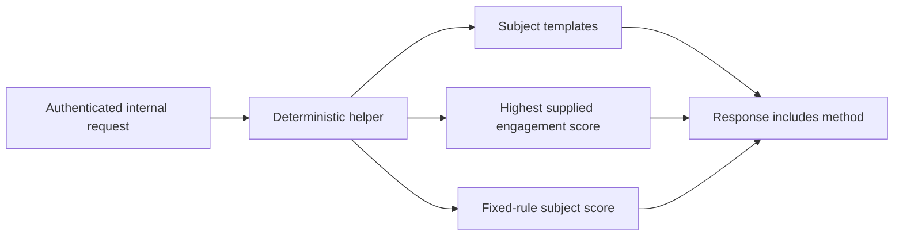

# Deterministic Email Assistance

## Current implementation

ApexMail does not deploy a planner/generator/verifier LLM pipeline, ONNX runtime, model registry, model training service, autonomous email agent, or external-provider integration.

The Rust `ai-service` crate provides authenticated deterministic helpers only:

Supported HTTP endpoints:

| Endpoint | Behavior | Limitation |
| --- | --- | --- |
| `POST /suggest` | Selects from fixed templates using the supplied topic and tone. | Does not generate text with a model. |
| `POST /optimize-time` | Returns the valid input slot with the highest supplied engagement score. | Does not learn from delivery events or predict future engagement. |
| `POST /content/score` | Applies fixed length, word-count, urgency, personalization, and emoji rules. | Score is not calibrated deliverability or engagement probability. |
| `GET /health` | Reports service availability and its disabled model/training capabilities. | It does not attest to any ML runtime. |

Every non-health endpoint requires the internal service token. The service does not send email or mutate campaign state.

## Unsupported capabilities

The following are intentionally absent from the deployment and API surface:

- Model upload, registration, inference, or prediction routes.
- Training jobs, checkpointing, promotion, or synthetic completion states.
- Qwen, ONNX, OpenAI, Anthropic, or other provider integration.
- Autonomous email reply generation or delivery.
- Tenant-shared multi-armed bandit experimentation.
- Planner, generator, verifier, RAG, and hallucination-control claims.

Historical training artifacts and experimental data are not evidence of a supported production ML feature.

## Requirements for any future model-serving system

Model-serving can be introduced only through a separately reviewed implementation that includes:

1. Authenticated and tenant-scoped request, storage, and evaluation boundaries.
2. Versioned, approved model artifacts with integrity verification and rollback.
3. Offline evaluation and production monitoring against explicit success and safety metrics.
4. Human-controlled promotion and rollback rather than immediate "training complete" state.
5. Input/output governance, abuse controls, audit trails, and cost limits.
6. Authoritative domain, billing, and delivery integrations; no generated DNS, routing, or pricing facts.

Until those requirements are implemented and deployed, product and operational documentation must describe the current helpers as deterministic heuristics.
