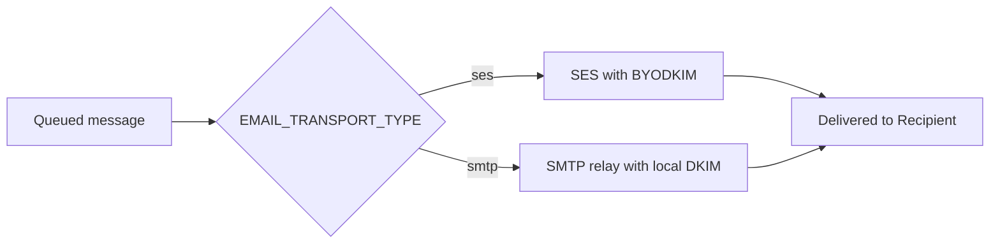
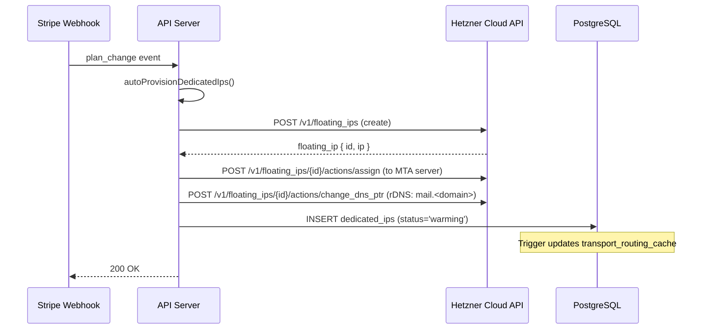
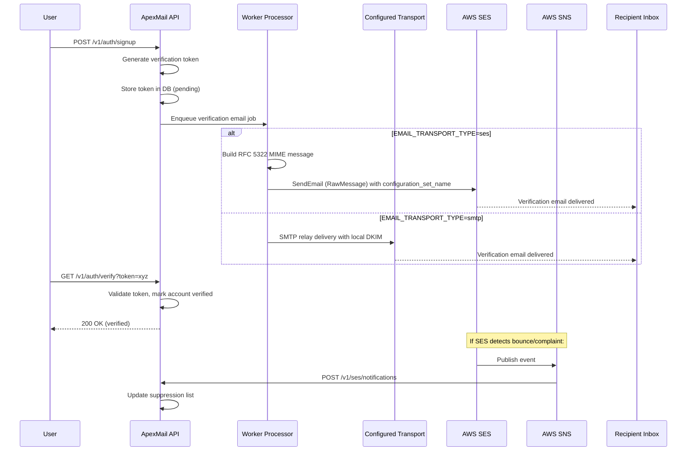

# Production Setup Guide — ApexMail

> **Last updated:** 2026-05-16
>
> This is the **single authoritative guide** for setting up an ApexMail production instance. It consolidates information from [`ses-setup.md`](ses-setup.md), [`configuration.md`](configuration.md), [`hetzner.md`](../tool-contracts/hetzner.md), [`ses.md`](../tool-contracts/ses.md), [`hybrid-email-infrastructure.md`](../architecture/hybrid-email-infrastructure.md), and the Rust source configuration.

---

## Table of Contents

1. [Architecture Overview](#1-architecture-overview)
2. [AWS SES Setup (Shared Pool)](#2-aws-ses-setup-shared-pool)
3. [Hetzner Cloud Setup (Dedicated IPs)](#3-hetzner-cloud-setup-dedicated-ips)
4. [Environment Variables Reference](#4-environment-variables-reference)
5. [Verification Email Flow](#5-verification-email-flow)
6. [Production Readiness Checklist](#6-production-readiness-checklist)
7. [Troubleshooting](#7-troubleshooting)

---

## 1. Architecture Overview

### Explicit Transport Model

ApexMail selects one outbound transport for a deployment with
`EMAIL_TRANSPORT_TYPE`. Production defaults to AWS SES (`ses`); operators may
select the configured SMTP relay with `smtp`. This is not a per-message,
tenant, plan, or dedicated-IP decision.

| Transport | Provider | Readiness requirement |
|-----------|----------|-----------------------|
| **AWS SES** (default) | AWS SES v2 | SES identity, BYODKIM, and custom MAIL FROM are all successful |
| **SMTP relay** | Operator-configured SMTP | Valid per-domain DKIM material and local DKIM enabled |



### Server Fleet

All infrastructure runs on **Hetzner Cloud** in the `eu-central` region (Falkenstein/Nuremberg).

| Server Name | Role | Private IP | Spec |
|-------------|------|-----------|------|
| `apx-api-1` | API server + Redis | `10.0.1.1` | CAX41 (16 vCPU, 32 GB RAM, 320 GB NVMe) |
| `apx-worker-1` | Worker processor + Inbound MTA | `10.0.1.2` | CAX41 |
| `apx-db-1` | PostgreSQL primary | `10.0.1.3` | CAX41 |
| `apx-db-2` | PostgreSQL standby | `10.0.1.4` | CAX41 |
| `apx-mon-1` | Prometheus + Grafana | `10.0.1.5` | CAX41 |

All servers are attached to a private network (`10.0.1.0/24`). Inter-server traffic uses private IPs exclusively.

### Cost Baseline

| Item | Monthly Cost |
|------|-------------|
| 5× CAX41 servers | ~€120 |
| Hetzner S3 (500 GB) | ~€12 |
| Dedicated floating IPs | ~€4/IP |
| **Total base infrastructure** | **~€132/mo + IPs** |

---

## 2. AWS SES Setup

This section covers configuring AWS SES for the explicit SES transport mode.

### 2.1 Prerequisites

- An AWS account with SES access
- A verified sending domain (or at least one verified email address for sandbox testing)
- IAM credentials with the required permissions

### 2.2 Create an IAM User

Create a dedicated IAM user (e.g. `apexmail-ses`) with the following policy. This policy follows the **principle of least privilege** — it grants only the SES and SNS actions needed for ApexMail's operation.

```json
{
  "Version": "2012-10-17",
  "Statement": [
    {
      "Sid": "ApexMailSES",
      "Effect": "Allow",
      "Action": [
        "ses:SendEmail",
        "ses:SendRawEmail",
        "ses:GetAccount",
        "ses:GetSendStatistics",
        "ses:GetSendQuota",
        "ses:CreateEmailIdentity",
        "ses:DeleteEmailIdentity",
        "ses:GetEmailIdentity",
        "ses:PutEmailIdentityDkimSigningAttributes",
        "ses:PutEmailIdentityMailFromAttributes",
        "ses:PutEmailIdentityConfigurationSetAttributes"
      ],
      "Resource": "*"
    },
    {
      "Sid": "ApexMailSNS",
      "Effect": "Allow",
      "Action": [
        "sns:Subscribe",
        "sns:ConfirmSubscription"
      ],
      "Resource": "arn:aws:sns:*:*:apexmail-*"
    }
  ]
}
```

> **Why this policy?** Dedicated IP permissions (`ses:GetDedicatedIps`, `ses:PutDedicatedIpInPool`, etc.) are **not** included because dedicated IPs are provisioned via Hetzner Cloud API, not SES. The SNS permissions are scoped to topics matching the `apexmail-*` naming pattern.

Save the **Access Key ID** and **Secret Access Key** — these will be set as [`AWS_ACCESS_KEY_ID`](#table-aws-ses-variables) and [`AWS_SECRET_ACCESS_KEY`](#table-aws-ses-variables).

### 2.3 Move Out of SES Sandbox

New SES accounts start in sandbox mode (can only send to verified email addresses). Request production access:

1. Go to **SES Console** → **Account dashboard** → **Request production access**
2. Describe your use case (transactional email platform)
3. AWS typically approves within 24 hours

Once approved, you can send to any recipient. The SES [rate limits](#rate-limits) below apply.

### 2.4 Verify Your Sending Domain

ApexMail **automatically creates SES domain identities** when tenants add domains via the dashboard or API ([`POST /v1/domains`](../api/endpoints/domains.md:24)). However, you may also verify manually:

```bash
aws sesv2 create-email-identity \
  --identity-type DOMAIN \
  --identity yourdomain.com
```

Do not use this manual command for ApexMail-managed customer domains because
it creates an Easy-DKIM identity. Domain verification configures the identity
with the generated per-domain BYODKIM key and custom MAIL FROM domain.

### 2.5 Create a Configuration Set

A configuration set enables SES to publish bounce, complaint, delivery, and send events to an SNS topic, which ApexMail's webhook consumes.

```bash
aws sesv2 create-configuration-set \
  --configuration-set-name apexmail-production
```

### 2.6 Add SNS Event Destination

First, create an SNS topic:

```bash
aws sns create-topic --name apexmail-ses-events
```

Then add it as an event destination on the configuration set:

```bash
aws sesv2 create-configuration-set-event-destination \
  --configuration-set-name apexmail-production \
  --event-destination-name sns-events \
  --event-destination '{
    "Enabled": true,
    "MatchingEventTypes": ["SEND", "DELIVERY", "BOUNCE", "COMPLAINT", "REJECT"],
    "SnsDestination": {
      "TopicArn": "arn:aws:sns:eu-west-1:ACCOUNT_ID:apexmail-ses-events"
    }
  }'
```

Replace `ACCOUNT_ID` with your AWS account ID.

### 2.7 Subscribe the ApexMail Webhook

```bash
aws sns subscribe \
  --topic-arn arn:aws:sns:eu-west-1:ACCOUNT_ID:apexmail-ses-events \
  --protocol https \
  --notification-endpoint https://api.apexmail.ee/v1/ses/notifications
```

SES will send a `SubscriptionConfirmation` request to the endpoint. The ApexMail API automatically confirms it.

### 2.8 DNS Records

For each sending domain, add the following DNS records:

| Type | Name | Value | Purpose |
|------|------|-------|---------|
| TXT | `bounce.<domain>` | `v=spf1 include:amazonses.com ~all` | Custom MAIL FROM SPF |
| MX | `bounce.<domain>` | `10 feedback-smtp.<aws-region>.amazonses.com` | Custom MAIL FROM MX |
| TXT | `<selector>._domainkey.<domain>` | `v=DKIM1; k=rsa; p=<generated-public-key>` | Direct BYODKIM public key |
| TXT | `_dmarc` | `v=DMARC1; p=quarantine; rua=mailto:dmarc@<domain>` | DMARC — policy for receivers |

ApexMail provides the exact DNS record values per domain from
`GET /v1/domains/:id/dns-records`.

### 2.9 Rate Limits

| Parameter | Value |
|-----------|-------|
| SES sending rate | 50 emails/second (adjustable via AWS support) |
| Daily sending quota | 100,000 emails/day (adjustable) |
| Max message size | 10 MB |

The worker processor enforces a conservative SES rate limit of **40 emails/second** (80% of quota) to provide headroom.

---

## 3. Hetzner Cloud Setup (Dedicated IPs)

This section covers provisioning and configuring the Hetzner Cloud infrastructure for **dedicated IP delivery via self-hosted SMTP**. This path is used automatically for tenants with dedicated IPs.

### 3.1 Project and API Token

1. Create a **Hetzner Cloud project** (e.g., `apexmail-production`)
2. Generate an **API token** with read/write scope
3. Store the token as [`HETZNER_API_TOKEN`](#table-hetzner-variables)

### 3.2 Server Provisioning

Provision CAX41 ARM servers using the [`hcloud` CLI](https://github.com/hetznercloud/cli) or the Hetzner Cloud API.

**Base image:** Ubuntu 24.04 LTS ARM64

**Example for a single server:**

```bash
hcloud server create \
  --name apx-api-1 \
  --type cax41 \
  --image ubuntu-24.04 \
  --location fsn1 \
  --ssh-key your-ssh-key-name \
  --network apexmail-private
```

Repeat for all 5 servers in the [fleet](#server-fleet):

| Server | Location | Additional Flags |
|--------|----------|-----------------|
| `apx-api-1` | `fsn1` | — |
| `apx-worker-1` | `fsn1` | — |
| `apx-db-1` | `fsn1` | — |
| `apx-db-2` | `nbg1` (different zone for HA) | — |
| `apx-mon-1` | `fsn1` | — |

> **HA note:** Deploy `apx-db-2` in a different datacenter (e.g., `nbg1`/Nuremberg) for PostgreSQL cross-zone failover.

### 3.3 Private Network

Create a private network and attach all servers:

```bash
hcloud network create --name apexmail-private --ip-range 10.0.1.0/24
hcloud server attach-to-network --network apexmail-private --ip 10.0.1.1 apx-api-1
hcloud server attach-to-network --network apexmail-private --ip 10.0.1.2 apx-worker-1
hcloud server attach-to-network --network apexmail-private --ip 10.0.1.3 apx-db-1
hcloud server attach-to-network --network apexmail-private --ip 10.0.1.4 apx-db-2
hcloud server attach-to-network --network apexmail-private --ip 10.0.1.5 apx-mon-1
```

### 3.4 Firewall Rules

Create a Hetzner Cloud firewall with the following rules:

| Source | Destination | Port(s) | Protocol | Purpose |
|--------|-------------|---------|----------|---------|
| Any | `apx-api-1` | 80, 443 | TCP | HTTP/HTTPS (nginx reverse proxy) |
| Any | `apx-worker-1` | 25, 587 | TCP | SMTP inbound |
| Private network | `apx-db-1/2` | 5432 | TCP | PostgreSQL |
| Private network | `apx-api-1` | 6379 | TCP | Redis |
| Private network | `apx-mon-1` | 9090, 3000 | TCP | Prometheus, Grafana |
| Ops VPN | All | 22 | TCP | SSH |
| All | All (outbound) | * | * | Allow all egress |

### 3.5 Floating IP Lifecycle

Dedicated IPs are managed as **Hetzner Cloud floating IPs** by the [`DedicatedIpProvider`](../../services/mail-server/crates/api-server/src/ip_provider.rs:170). The lifecycle has four stages:

#### 3.5.1 Provisioning

Triggered automatically when a tenant upgrades to a plan with dedicated IPs (Stripe webhook → `autoProvisionDedicatedIps()`), or manually via `POST /v1/dedicated-ips`.



The provisioning flow in detail:

1. **Create** a floating IP: `POST /v1/floating_ips` (`type: "type: "` → `ip`)
2. **Assign** it to the MTA server: `POST /v1/floating_ips/{id}/actions/assign`
3. **Set rDNS** to `mail.<tenant_primary_domain>`: `POST /v1/floating_ips/{id}/actions/change_dns_ptr`
4. **Insert** a row in the `dedicated_ips` table with `status='warming'`
5. **DB trigger** [`trg_update_transport_routing`](../architecture/hybrid-email-infrastructure.md:163) updates `transport_routing_cache`
6. Subsequent messages for this tenant route via **self-hosted SMTP with the dedicated IP**

#### 3.5.2 Warmup (45-Day Schedule)

New IPs require a graduated warmup schedule to build reputation with mailbox providers. The [`tick_warmup()`](../../services/mail-server/crates/api-server/src/ip_provider.rs:505) cron job manages this.

| Day Range | Daily Send Limit |
|-----------|-----------------|
| 0-1 | 50 |
| 2-3 | 100 |
| 4-5 | 250 |
| 6-7 | 500 |
| 8-10 | 1,000 |
| 11-14 | 2,500 |
| 15-20 | 5,000 |
| 21-28 | 10,000 |
| 29-35 | 25,000 |
| 36-44 | 50,000 |
| 45+ | Unlimited |

> **Overflow behavior:** Traffic exceeding the warmup limit overflows to SES shared sending automatically — no messages are dropped.

#### 3.5.3 Steady State

Once warmed (`status='active'`):
- The IP handles **all tenant traffic** via [`SmtpTransport`](../../services/mail-server/crates/worker-processors/src/email/transport.rs:49)
- `ip_daily_usage` tracks send volume, bounces, and complaints
- DNSBL monitoring runs every **15 minutes**
- Alerts fire if the IP is blacklisted

#### 3.5.4 Release

When a tenant downgrades or manually releases an IP:

1. `DELETE /v1/dedicated-ips/{ip_id}` is called
2. [`DedicatedIpProvider::release_ip()`](../../services/mail-server/crates/api-server/src/ip_provider.rs:397) deletes the Hetzner floating IP: `DELETE /v1/floating_ips/{hetzner_id}`
3. The `dedicated_ips` row is updated to `status='retired'`
4. The DB trigger updates `transport_routing_cache`
5. If no remaining dedicated IPs, the tenant reverts to **SES shared pool**

### 3.6 SMTP MTA Deployment

The worker processor uses SMTP to deliver from Hetzner floating IPs. Key configuration:

**Postfix configuration** (if using Postfix as the MTA relay):

```conf
# /etc/postfix/main.cf
myhostname = mail.apexmail.ee
mydomain = apexmail.ee
myorigin = $mydomain

# Network settings
inet_interfaces = all
inet_protocols = ipv4
smtp_bind_address = 0.0.0.0

# TLS settings
smtpd_tls_cert_file = /etc/ssl/certs/apexmail.pem
smtpd_tls_key_file = /etc/ssl/private/apexmail.key
smtpd_use_tls = yes

# DKIM — sign with OpenDKIM or via ApexMail's native DKIM signing
# (see DKIM configuration in Section 4)

# Queue settings
max_queue_lifetime = 1d
bounce_queue_lifetime = 1d

# Rate limiting
default_destination_concurrency_limit = 20
default_destination_rate_delay = 1s
```

> **Note:** ApexMail uses a **native Rust MTA** (not Postfix) in the worker-processor. The Postfix config above is for operators deploying a standalone relay.

### 3.7 STONITH Fencing (PostgreSQL HA)

For PostgreSQL automatic failover, the **Hetzner Robot API** performs hardware-level fencing:

1. HA watchdog on `apx-db-2` detects primary (`apx-db-1`) unresponsive for > 30s
2. Watchdog calls `POST /reset` via Robot API to hard-reset `apx-db-1`
3. Once reset is confirmed, `apx-db-2` promotes itself via `pg_ctl promote`
4. API servers reconnect to the new primary

**Robot API credentials:** Stored as `HETZNER_ROBOT_USER` and `HETZNER_ROBOT_PASS` (fencing script only — not used by the application).

> **Safety:** Rate-limited to 1 reset per 10 minutes to prevent split-brain cascading resets.

### 3.8 Monitoring

| Component | Tool | Details |
|-----------|------|---------|
| System metrics | `node_exporter` + Prometheus | Running on every server, scraped by `apx-mon-1` |
| Email metrics | Application metrics | Bounce rate, complaint rate, send volume per IP |
| DNSBL | Cron job every 15 min | Alerts if any dedicated IP is blacklisted |
| Dashboards | Grafana | On `apx-mon-1` (port 3000) |
| Disk alerts | Prometheus | Warning at 80% usage |
| Logs | Centralized syslog | All servers forward to `apx-mon-1` |

Key Prometheus metrics:
- `apexmail_ses_emails_sent_total` — SES send counter
- `apexmail_dedicated_ips_total` — Total dedicated IPs
- `apexmail_dedicated_ip_warmup_progress` — Per-IP warmup progress
- `apexmail_smtp_emails_sent_total` — SMTP send counter
- `apexmail_ses_errors_total` — SES API errors (critical if > 10/min)

---

## 4. Environment Variables Reference

### 4.1 AWS SES Variables

| Variable | Required | Default | Description |
|----------|----------|---------|-------------|
| `AWS_ACCESS_KEY_ID` | **Yes** | — | IAM access key from [Section 2.2](#22-create-an-iam-user) |
| `AWS_SECRET_ACCESS_KEY` | **Yes** | — | IAM secret key from [Section 2.2](#22-create-an-iam-user) |
| `AWS_REGION` | Yes | `eu-west-1` | AWS region for SES ([`services/mail-server/crates/api-server/src/config.rs:479`](../../services/mail-server/crates/api-server/src/config.rs:479)) |
| `SES_CONFIGURATION_SET` | **Yes** | — | Name of the configuration set created in [Section 2.5](#25-create-a-configuration-set) |
| `SES_IP_POOL_PREFIX` | No | `apexmail` | Prefix for SES IP pool naming |
| `SES_DEFAULT_WARMUP_DAYS` | No | `14` | Default warmup days (note: Hetzner IP warmup uses 45-60 day schedule) |

**Example block:**
```env
AWS_ACCESS_KEY_ID=AKIAxxxxxxxxxxxx
AWS_SECRET_ACCESS_KEY=xxxxxxxxxxxxxxxxxxxxxxxxxxxxxxxxxxxxxxxx
AWS_REGION=eu-west-1
SES_CONFIGURATION_SET=apexmail-production
DKIM_PRIVATE_KEY_ENCRYPTION_KEY=<64-hex-characters>
SES_IP_POOL_PREFIX=apexmail
```

### 4.2 Hetzner Cloud Variables

| Variable | Required | Default | Description |
|----------|----------|---------|-------------|
| `HETZNER_API_TOKEN` | **Yes** (for dedicated IPs) | — | Hetzner Cloud API token from [Section 3.1](#31-project-and-api-token) |
| `HETZNER_DEFAULT_LOCATION` | No | `fsn1` | Default datacenter for new floating IPs (e.g., `fsn1`, `nbg1`, `hel1`) |
| `HETZNER_MTA_SERVER_ID` | **Yes** (single-server) | — | Hetzner server ID to assign floating IPs to |

**Example block:**
```env
HETZNER_API_TOKEN=your-hetzner-cloud-api-token
HETZNER_DEFAULT_LOCATION=fsn1
HETZNER_MTA_SERVER_ID=12345678
```

### 4.3 SMTP Configuration (Self-Hosted Relay)

Needed only when this deployment explicitly uses `EMAIL_TRANSPORT_TYPE=smtp`.

| Variable | Required | Default | Description |
|----------|----------|---------|-------------|
| `EMAIL_TRANSPORT_TYPE` | No | `ses` | Set to `smtp` to force all traffic via SMTP relay |
| `SMTP_HOST` | Conditional | `localhost` | SMTP relay host |
| `SMTP_PORT` | No | `587` | SMTP relay port |
| `SMTP_SECURE` | No | `true` | Use TLS |
| `SMTP_USERNAME` | Conditional | — | SMTP auth username |
| `SMTP_PASSWORD` | Conditional | — | SMTP auth password |
| `OUTBOUND_IPS` | Conditional | — | Comma-separated outbound IPs for source binding |
| `MTA_HOSTNAME` | Conditional | — | HELO/EHLO hostname |

> **Note:** `EMAIL_TRANSPORT_TYPE` selects the active transport for all
> messages in the deployment. It is not a legacy override or fallback policy.

### 4.4 DKIM Configuration

| Variable | Required | Default | Description |
|----------|----------|---------|-------------|
| `DKIM_PRIVATE_KEY_ENCRYPTION_KEY` | **Yes** | — | 64 hexadecimal characters (32 bytes) used to encrypt generated domain keys |
| `DKIM_ENABLED` | SMTP only | `true` | Required to enable local per-domain SMTP signing |

**Example block:**
```env
DKIM_PRIVATE_KEY_ENCRYPTION_KEY=<64-hex-characters>
DKIM_ENABLED=true
```

> **Note:** ApexMail generates a unique selector and key pair for every
> customer domain. SES uses the same protected key through BYODKIM; SMTP uses
> it for local signing. Operators must not configure a global customer key.

### 4.5 Complete `.env` Template

Below is the complete set of email-transport-related environment variables. For the full template including database, Redis, auth, and observability variables, see [`.env.production.example`](../../.env.production.example:1).

```env
# =============================================================================
# AWS SES (Shared Pool — Required)
# =============================================================================
AWS_ACCESS_KEY_ID=AKIAxxxxxxxxxxxx
AWS_SECRET_ACCESS_KEY=xxxxxxxxxxxxxxxxxxxxxxxxxxxxxxxxxxxxxxxx
AWS_REGION=eu-west-1
SES_CONFIGURATION_SET=apexmail-production

# =============================================================================
# Hetzner Cloud (Dedicated IPs — Required if offering dedicated IPs)
# =============================================================================
HETZNER_API_TOKEN=your-hetzner-cloud-api-token
HETZNER_DEFAULT_LOCATION=fsn1
HETZNER_MTA_SERVER_ID=12345678

# =============================================================================
# Email Transport (SES is the deployment default)
# =============================================================================
EMAIL_TRANSPORT_TYPE=ses
```

---

## 5. Verification Email Flow

This section documents the **end-to-end verification email flow**, which is triggered whenever ApexMail needs to verify a user's email address or a sending domain.

### 5.1 Account Verification Flow

When a new user signs up, ApexMail sends a verification email to confirm ownership of their email address.



**Key details:**
- All verification emails use the configured deployment transport and are not special-cased.
- `EMAIL_TRANSPORT_TYPE=ses` sends them through SES; `smtp` sends them through the configured relay.
- The SES [`configuration_set_name`](#25-create-a-configuration-set) tags the email for bounce/complaint tracking
- If the email bounces (invalid address), the SNS → webhook pipeline [suppresses the recipient](#525-bouncecomplaint-feedback-loop)

### 5.2 Domain Verification Flow

When a tenant adds a sending domain, ApexMail guides them through DNS verification.

#### 5.2.1 Add Domain

```http
POST /v1/domains
Content-Type: application/json

{
  "name": "example.com"
}
```

The response contains the pending domain identifier and verification booleans.
It never exposes a private key. The operator or client then retrieves the
generated public DNS values:

```http
GET /v1/domains/:id/dns-records
```

#### 5.2.2 Configure DNS (User Action)

The user adds the following DNS records at their DNS provider:

| Type | Name | Value |
|------|------|-------|
| TXT | `bounce` | `v=spf1 include:amazonses.com ~all` |
| MX | `bounce` | `10 feedback-smtp.<aws-region>.amazonses.com` |
| TXT | `<generated-selector>._domainkey` | `v=DKIM1; k=rsa; p=<generated-public-key>` |
| TXT | `_dmarc` | `v=DMARC1; p=quarantine; rua=mailto:dmarc@example.com` |

The selector, public key, and MX region are domain- and deployment-specific;
the DNS-records response is authoritative. No ApexMail service-host CNAME or
SES Easy-DKIM CNAME is part of this flow.

#### 5.2.3 Verify Domain

```http
POST /v1/domains/:id/verify
```

The system verifies the exact SPF include, direct DKIM public key, DMARC
presence, and custom MAIL FROM MX target. It then configures SES BYODKIM and
checks the SES identity's real sender-readiness state.

Verification statuses:

| Status | Meaning |
|--------|---------|
| ⏳ **Pending** | DNS records not yet found (waiting for propagation) |
| ✅ **Verified** | All records valid and verified |
| ⚠️ **Pending** | DNS or SES is still propagating / incomplete |

#### 5.2.4 On Verify: SES Identity Creation

Once the DNS records pass, the system creates or updates the SES identity with
the generated selector and protected private key using BYODKIM, configures
`bounce.<domain>` with `REJECT_MESSAGE` on MX failure, and reads back SES
status. The domain becomes verified only when SES reports the identity,
external DKIM signing, and custom MAIL FROM domain as successful.

### 5.3 Bounce/Complaint Feedback Loop

The entire feedback pipeline:

```
SES delivers email
  → Bounce or complaint occurs at recipient MX
  → SES publishes to SNS (via configuration set event destination)
  → SNS delivers HTTPS POST to https://api.apexmail.ee/v1/ses/notifications
  → API processes event
```

| Event Type | Action Taken |
|------------|-------------|
| **SubscriptionConfirmation** | Auto-confirmed by fetching `SubscribeURL` |
| **Hard Bounce** | Suppress recipient in `suppression_list`, update message status to `bounced` |
| **Soft Bounce** | Log for review; 3 soft bounces in 7 days → treat as hard bounce |
| **Complaint** | Immediately suppress recipient, log feedback type |
| **Delivery** | Update message status to `delivered` |

All events are:
- Correlated with the original message via `X-ApexMail-MessageId` headers
- Queued to Redis list `ses:webhook_queue` for tenant webhook delivery
- Stored in `email_events` table with `source: 'ses'`

> **Data residency:** No customer data is stored in AWS. SES receives email content for sending but does not persist it. SNS notifications are transient — consumed by the webhook and stored in PostgreSQL on Hetzner infrastructure.

---

## 6. Production Readiness Checklist

### 6.1 AWS SES

- [ ] IAM user created with the scoped policy from [Section 2.2](#22-create-an-iam-user)
- [ ] SES sandbox exit approved by AWS
- [ ] Configuration set created (name matches `SES_CONFIGURATION_SET`)
- [ ] SNS topic created for event delivery
- [ ] Event destination configured on configuration set (BOUNCE, COMPLAINT, DELIVERY, SEND, REJECT)
- [ ] SNS webhook subscribed to `https://api.apexmail.ee/v1/ses/notifications`
- [ ] Test email sent and confirmed delivered
- [ ] Bounce/complaint flow tested (send to a known invalid address, verify SNS notification is received)

### 6.2 Hetzner Cloud

- [ ] Hetzner project created and API token generated with read/write scope
- [ ] All 5 servers provisioned (CAX41, Ubuntu 24.04 ARM64)
- [ ] Private network created (`10.0.1.0/24`) and all servers attached
- [ ] Firewall rules applied per [Section 3.4](#34-firewall-rules)
- [ ] SSH key configured and access tested from ops VPN
- [ ] `/etc/hosts` configured on each server (no internal DNS server)
- [ ] PostgreSQL primary + standby configured with streaming replication
- [ ] STONITH fencing configured via Hetzner Robot API credentials
- [ ] Floating IPs can be provisioned via `DedicatedIpProvider` (test with a single IP)
- [ ] rDNS set correctly per floating IP
- [ ] `node_exporter` running on all servers
- [ ] Prometheus scraping configured on `apx-mon-1`
- [ ] Grafana dashboards imported
- [ ] DNSBL monitoring cron job configured (15-minute interval)
- [ ] `tick_warmup()` cron job active for IP warmup progression

### 6.3 Environment Variables

- [ ] `AWS_ACCESS_KEY_ID` and `AWS_SECRET_ACCESS_KEY` set (not placeholder values)
- [ ] `AWS_REGION` set (use `eu-west-1` to match code defaults)
- [ ] `SES_CONFIGURATION_SET` set (not empty)
- [ ] `HETZNER_API_TOKEN` set (or omitted if not offering dedicated IPs)
- [ ] `HETZNER_DEFAULT_LOCATION` set
- [ ] `HETZNER_MTA_SERVER_ID` set (or omitted in multi-server orchestrator mode)
- [ ] All production secrets are unique, cryptographically-random values (min 32 bytes)
- [ ] No placeholder values remain (the API server's [`validate_production()`](../../services/mail-server/crates/api-server/src/config.rs:877) rejects common patterns like `replace-me`, `change-me`, `secret`)

### 6.4 Verification Flow

- [ ] New user signup sends verification email successfully
- [ ] Verification link in email confirms the account
- [ ] Domain verification DNS checks work (`POST /v1/domains/:id/verify`)
- [ ] SES identity auto-creation on domain verify works
- [ ] Bounce/complaint SNS → webhook pipeline is functional
- [ ] Suppression list is updated correctly on bounce

### 6.5 General

- [ ] Health endpoints respond: `GET /health`, `GET /ready`
- [ ] Database migrations applied (the deploy runs the `migrator` one-shot job automatically — see deploy/DEPLOYMENT.md § "Database migrations"; verify `SELECT count(*) FROM _sqlx_migrations` matches the migration count)
- [ ] WAL archiving and automated backups configured (to Hetzner S3)
- [ ] Stripe webhook endpoint configured for billing integration
- [ ] Alerting rules configured in Grafana/Prometheus

---

## 7. Troubleshooting

### 7.1 SES Issues

| Symptom | Likely Cause | Resolution |
|---------|-------------|------------|
| "Email address is not verified" | Sending domain not verified in SES | Add domain via ApexMail dashboard or run `aws sesv2 create-email-identity` |
| "Account sending paused" | High bounce/complaint rate | Review suppression list, reduce sends to invalid addresses |
| "Throttling — Maximum sending rate exceeded" | SES per-second rate limit reached | Request limit increase via SES console, or reduce worker concurrency |
| Webhook not receiving SNS events | Configuration set not set, or SNS subscription not confirmed | Verify `SES_CONFIGURATION_SET` matches the created config set; check SNS topic subscriptions in AWS console |
| Bounce/complaint not updating in app | SNS → webhook pipeline broken | Check webhook endpoint is reachable, confirm SNS subscription is confirmed |

### 7.2 Hetzner Issues

| Symptom | Likely Cause | Resolution |
|---------|-------------|------------|
| Floating IP not assignable | IP already assigned to another server | Release the IP first, or check Hetzner Cloud console |
| rDNS not updating | API token lacks write scope | Regenerate token with read/write permissions |
| Tenant not routing via SMTP | `transport_routing_cache` stale | Cache refreshes every 30 seconds; or call [`invalidate_cache()`](../../services/mail-server/crates/worker-processors/src/email/transport_router.rs:202) |
| IP showing as blacklisted | DNSBL listing | Check DNSBL monitoring alerts; initiate delisting process |
| Warmup not progressing | `tick_warmup()` cron not running | Verify the cron job is active |

### 7.3 Transport Routing Issues

| Symptom | Likely Cause | Resolution |
|---------|-------------|------------|
| Messages unexpectedly routed to SES | `transport_routing_cache` not updated after IP assignment | Check DB trigger `trg_update_transport_routing` is active; verify `transport_routing_cache` table has the tenant entry |
| Messages unexpectedly routed to SMTP | Tenant incorrectly has active dedicated IP | Verify `dedicated_ips` table for the tenant; check if retired IPs are still in cache |
| Upgrade/downgrade not triggering IP provision/release | Stripe webhook not firing | Check Stripe webhook logs; verify `autoProvisionDedicatedIps()` endpoint is reachable |

### 7.4 Warmup Schedule Discrepancy

**Note:** There is a known discrepancy in the codebase regarding warmup duration:
- **Worker processor config** ([`config.rs`](../../services/mail-server/crates/worker-processors/src/common/config.rs:197)): 9-day schedule `[50, 100, 200, 400, 800, 1500, 3000, 5000, 10000]`
- **IP provider tests** ([`ip_provider.rs`](../../services/mail-server/crates/api-server/src/ip_provider.rs:708)): Full warmup period is 60 days
- **Documentation** ([`hetzner.md`](../tool-contracts/hetzner.md:192)): 45-day graduated schedule

The **intended production behavior** is the **45-day schedule** documented in [Section 3.5.2](#352-warmup-45-day-schedule). The worker processor's 9-day schedule is a simplified default for development/testing. Align your deployment with the 45-day schedule for proper IP reputation building.

---

## Related Documents

| Document | Path | Content |
|----------|------|---------|
| AWS SES Setup Guide | [`docs/deployment/ses-setup.md`](ses-setup.md) | Standalone SES setup walkthrough |
| Configuration Reference | [`docs/deployment/configuration.md`](configuration.md) | All environment variables |
| Helx Chart Deployment | [`docs/deployment/helm.md`](helm.md) | Kubernetes deployment |
| Quickstart Guide | [`docs/deployment/quickstart.md`](quickstart.md) | Local development |
| SES Tool Contract | [`docs/tool-contracts/ses.md`](../tool-contracts/ses.md) | Internal SES engineering spec |
| Hetzner Tool Contract | [`docs/tool-contracts/hetzner.md`](../tool-contracts/hetzner.md) | Internal Hetzner engineering spec |
| Hybrid Infrastructure Architecture | [`docs/architecture/hybrid-email-infrastructure.md`](../architecture/hybrid-email-infrastructure.md) | Architecture deep-dive |
| ADR 0011 — Dual Delivery | [`docs/adr/0011-dual-delivery-ses-primary.md`](../adr/0011-dual-delivery-ses-primary.md) | Decision record |
| Domains API | [`docs/api/endpoints/domains.md`](../api/endpoints/domains.md) | Domain verification API reference |
| Outbound Delivery Contract | [`docs/architecture/outbound-delivery.md`](../architecture/outbound-delivery.md) | Delivery architecture rules |
