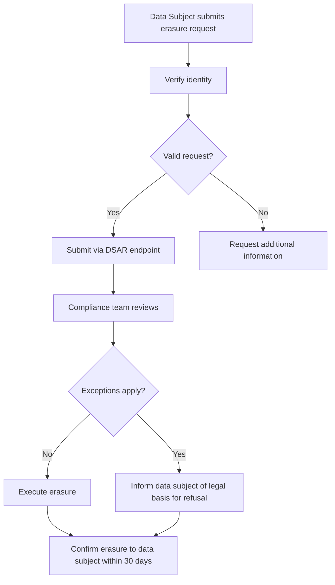

# GDPR & CCPA Compliance Documentation

> **Last Updated:** 2026-05-11
> **Jurisdiction:** European Union (GDPR), California (CCPA)
> **Data Controller:** ApexMail OU — Customers are data controllers; ApexMail is a data processor.
> **Data Processor:** ApexMail OU,注册 address: Harju maakond, Tallinn, Kesklinna linnaosa, Veskiposti tn 2-1002, 10138, Estonia

---

## Table of Contents

1. [Data Processing Addendum (DPA)](#1-data-processing-addendum-dpa)
2. [Data Retention Policies](#2-data-retention-policies)
3. [Right to Erasure (Article 17) Procedure](#3-right-to-erasure-article-17-procedure)
4. [Data Portability (Article 20) Procedure](#4-data-portability-article-20-procedure)
5. [Sub-processor List](#5-sub-processor-list)
6. [Standard Contractual Clauses (SCC)](#6-standard-contractual-clauses-scc)
7. [CCPA Specific Requirements](#7-ccpa-specific-requirements)
8. [Data Protection Impact Assessment (DPIA)](#8-data-protection-impact-assessment-dpia)
9. [Data Subject Access Request (DSAR) Procedure](#9-data-subject-access-request-dsar-procedure)
10. [Contact for Data Protection Officer](#10-contact-for-data-protection-officer)
11. [Technical Implementation Reference](#11-technical-implementation-reference)

---

## 1. Data Processing Addendum (DPA)

### Standard Terms

ApexMail's DPA is incorporated into the Terms of Service and covers:

| Clause | Description |
|--------|-------------|
| **Subject matter** | Processing of personal data for email delivery, analytics, and related services |
| **Duration** | Duration of the service agreement |
| **Nature and purpose** | Email transmission, delivery tracking, spam filtering, analytics, compliance services |
| **Personal data types** | Email addresses, IP addresses, email content, tracking data, account information |
| **Data categories** | Customer's end-user data as defined in the service agreement |
| **Processing instructions** | Only process data as documented in the service agreement and this DPA |
| **Data minimization** | Only data necessary for email delivery and analytics services |
| **Security measures** | As documented in [Security Systems](../../docs/security/Security_Systems.md) |

### DPA Acceptance

The DPA is accepted by all customers during account creation. A signed copy can be downloaded from the ApexMail dashboard:

```
Settings → Compliance → Download DPA
```

### Technical Safeguards

All data processing is governed by the enforcement mechanisms in:

- [`isolation/src/encryption.rs`](../../services/mail-server/crates/isolation/src/encryption.rs) — AES-256-GCM envelope encryption for data at rest
- [`isolation/src/config.rs`](../../services/mail-server/crates/isolation/src/config.rs) — Tenant isolation via separate encryption keys
- [`compliance/src/routes.rs`](../../services/mail-server/crates/compliance/src/routes.rs) — Tenant-scoped audit logging
- [`mail-common/src/pii.rs`](../../services/mail-server/crates/mail-common/src/pii.rs) — PII redaction (IPv6 /64 truncation, email pattern detection)

---

## 2. Data Retention Policies

### Retention Schedule

| Data Category | Active Retention | Archive Retention | Deletion | Legal Basis |
|---------------|-----------------|-------------------|----------|-------------|
| Account information | Duration of account + 90 days | — | 90 days after closure | Contract performance (Art 6(1)(b)) |
| Email content (queued) | 30 days after delivery | — | 30 days | Service provision |
| Email delivery logs | 90 days | 365 days (aggregated) | 365 days | Legal obligation (Art 6(1)(c)) |
| Tracking events (opens/clicks) | 24 months | — | 24 months | Legitimate interest (Art 6(1)(f)) |
| Billing records | 7 years | — | 7 years | Legal obligation (Art 6(1)(c)) |
| Audit logs | 12 months | 36 months | 36 months | Compliance (Art 6(1)(c)) |
| Support tickets | 24 months | — | 24 months | Contract performance |
| Analytics data (aggregated) | 36 months | — | 36 months | Legitimate interest |
| API request logs | 90 days | — | 90 days | Security (Art 6(1)(f)) |

### Automated Enforcement

Data retention is enforced at the database level:

- PostgreSQL partitioned tables use `DROP PARTITION` for time-based purging (see [`migrations/050_partition_high_volume_tables.sql`](../../services/mail-server/migrations/050_partition_high_volume_tables.sql))
- ClickHouse data uses TTL-based expiration configured in [`clickhouse_engine.rs`](../../services/mail-server/crates/analytics/src/clickhouse_engine.rs)

### Customer-Configurable Retention

Customers can configure custom retention periods via the dashboard:

```
Settings → Compliance → Data Retention
```

Custom periods must be >= minimum required by law and <= maximum allowed by service plan.

---

## 3. Right to Erasure (Article 17) Procedure

### Process Flow



### Request Submission

Data subjects can submit erasure requests via:

1. **DSAR Portal:** `https://apexmail.ee/privacy/dsar`
2. **Email:** privacy@apexmail.ee
3. **Post:** Registered address (see footer)

### Required Information

- Full name
- Email address(es) associated with the account
- Description of data to be erased
- Verification of identity (government ID or equivalent)

### Erasure Execution (Technical)

When a right to erasure request is approved, the following operations are performed:

```sql
-- 1. Anonymize the user's account
UPDATE mail_accounts
SET email = 'deleted-' || id || '@deleted.apexmail.ee',
    display_name = 'Deleted User',
    updated_at = NOW()
WHERE id = <account_id>;

-- 2. Remove PII from delivery logs (anonymize, not delete — legal retention)
UPDATE email_delivery_log
SET recipient = 'redacted@deleted.apexmail.ee',
    recipient_domain = 'deleted.apexmail.ee'
WHERE account_id = <account_id>
  AND created_at < NOW() - INTERVAL '90 days';

-- 3. Delete tracking data
DELETE FROM tracking_events
WHERE account_id = <account_id>;

-- 4. Purge message content (not metadata)
UPDATE mail_messages
SET body_html = NULL,
    body_text = NULL,
    subject = '[Deleted]',
    has_attachments = FALSE
WHERE account_id = <account_id>;
```

### Exceptions (Article 17(3))

The right to erasure may be refused when processing is necessary for:

- Compliance with a legal obligation (Art 17(3)(e))
- Establishment, exercise, or defense of legal claims (Art 17(3)(e))
- Archiving purposes in the public interest (Art 17(3)(d))

### Response Timeline

- **Acknowledgment:** Within 72 hours of verified request
- **Decision:** Within 30 days (extendable by 60 days for complex requests)
- **Notification:** Data subject informed of any extension within the first 30 days

---

## 4. Data Portability (Article 20) Procedure

### Scope

Data subjects have the right to receive their personal data in a structured, commonly used, machine-readable format, and to transmit that data to another controller.

### Available Export Formats

| Data Category | Format | Schema |
|---------------|--------|--------|
| Account information | JSON | [Account schema](../../docs/api/endpoints/account.md) |
| Email messages | MBOX / JSON | RFC 5322-compliant |
| Delivery logs | CSV / JSON | [Events API schema](../../docs/api/endpoints/events.md) |
| Analytics reports | CSV / JSON | [Analytics schema](../../docs/api/endpoints/analytics.md) |

### Self-Service Export

Data subjects can export their data via:

```
Dashboard → Settings → Privacy → Export My Data
```

### API-Based Export (for Enterprise customers)

```bash
# Initiate export
curl -X POST https://api.apexmail.ee/v1/account/export \
  -H "X-API-Key: <api-key>" \
  -H "Content-Type: application/json" \
  -d '{
    "format": "json",
    "data_types": ["messages", "delivery_logs", "analytics"],
    "date_range": {"start": "2025-01-01", "end": "2026-05-11"}
  }'

# Response includes a download URL valid for 7 days
```

### Response Timeline

- **Standard export:** Available within 48 hours
- **Large volume export (>10K records):** Available within 14 days

---

## 5. Sub-processor List

| Sub-processor | Service | Location | Data Access | Safeguards |
|---------------|---------|----------|-------------|------------|
| **Hetzner Cloud GmbH** | Cloud infrastructure | Finland (primary), Germany (standby) | Encrypted data at rest | DPA executed, EU-based |
| **AWS (Amazon Web Services)** | SES email delivery | eu-west-1 (Ireland) | Email content in transit only | DPA executed, SCCs |
| **Redis Ltd** | Caching / rate limiting | Same as primary infra | Ephemeral cache data | No persistent storage |
| **ClickHouse Inc** | Analytics database | Same as primary infra | Aggregated analytics data | EU-hosted |
| **Stripe Inc** | Payment processing | US (PCI-DSS compliant) | Billing data only | DPA executed, SCCs |
| **Elastic.co** | Log aggregation | Same as primary infra | Operational logs | EU-hosted |

### Sub-processor Changes

ApexMail will notify customers of any sub-processor changes at least 30 days in advance. Customers may object to new sub-processors within 14 days of notification.

---

## 6. Standard Contractual Clauses (SCC)

### Applicability

SCCs (2021/914/EU) apply to all data transfers from the EEA to third countries where an adequate level of protection has not been recognized by the European Commission.

### Current Adequacy Decisions

Where data is processed within the EEA (Finland, Germany, Estonia), no SCCs are required as adequacy is presumed.

### Data Transfers

| Destination | Legal Basis | Mechanism |
|-------------|-------------|-----------|
| AWS Ireland (eu-west-1) | Adequacy decision | EEA-based processing |
| Stripe (US) | SCCs | Module 2 (processor-to-processor) |
| Hetzner Finland/Germany | Adequacy decision | EEA-based processing |

### SCC Execution

Enterprise customers requiring signed SCCs can request them via:

```
Dashboard → Settings → Compliance → Request SCCs
```

Signed SCCs are returned within 5 business days.

---

## 7. CCPA Specific Requirements

### CCPA Rights

ApexMail supports the following California Consumer Privacy Act (CCPA) rights as amended by the California Privacy Rights Act (CPRA):

| Right | Implementation | Response Time |
|-------|----------------|---------------|
| **Right to Know** (CCPA §1798.110) | DSAR endpoint returns categories and specific pieces of personal data collected | 45 days |
| **Right to Delete** (CCPA §1798.105) | Right to erasure procedure (see §3) | 45 days |
| **Right to Opt-Out** (CCPA §1798.120) | "Do Not Sell My Personal Information" link | Immediate |
| **Right to Correct** (CCPA §1798.106) | Account settings / support request | 45 days |
| **Right to Non-Discrimination** (CCPA §1798.125) | No price/service changes for exercising rights | Ongoing |

### CCPA Definitions

- **Business:** ApexMail OU (determines purposes and means of processing)
- **Service Provider:** ApexMail when processing on behalf of customers
- **Third Party:** Sub-processors listed in §5
- **Sale:** ApexMail does **not** sell personal data. No data is exchanged for monetary or other valuable consideration.

### "Do Not Sell My Personal Information"

California residents may opt out of any potential data sharing via:

```
https://apexmail.ee/privacy/do-not-sell
```

Since ApexMail does not sell personal data, this link serves as a confirmation page and allows users to:

1. Verify that no data selling occurs
2. Submit preference signals via GPC (Global Privacy Control)
3. Contact us with any concerns

### CCPA Metrics Reporting (Annual)

ApexMail publishes annual CCPA metrics including:

- Number of verifiable requests to know
- Number of verifiable requests to delete
- Number of verifiable requests to opt-out
- Mean days to respond
- Total number of requests denied

---

## 8. Data Protection Impact Assessment (DPIA)

### DPIA Process

ApexMail conducts DPIAs for any processing activity that is likely to result in high risk to individuals' rights and freedoms, as required by GDPR Article 35.

### Triggers for DPIA

- Systematic and extensive profiling with significant effects
- Large-scale processing of special categories of data
- Systematic monitoring of publicly accessible areas
- Introduction of new technologies for data processing
- Cross-linking of data from multiple sources

### DPIA Template

Each DPIA includes:

1. **Systematic description** of processing activities
2. **Assessment of necessity and proportionality**
3. **Assessment of risks** to data subjects
4. **Mitigation measures** (encryption, access controls, pseudonymization)

### Current DPIAs

| DPIA | Date | Status | Processing Activity |
|------|------|--------|---------------------|
| DPIA-001 | 2025-06-15 | Approved | Email delivery analytics |
| DPIA-002 | 2025-09-01 | Approved | AI-powered send-time optimization |
| DPIA-003 | 2026-01-10 | In Progress | Content scanning / DLP features |
| DPIA-004 | 2026-03-20 | Approved | Tracking pixel and link rewriting |

---

## 9. Data Subject Access Request (DSAR) Procedure

### Submission

Data subjects can submit DSARs via the same channels listed in §3 (Right to Erasure).

### Processing Workflow

1. **Identity Verification** — Email verification link sent to the data subject's verified email
2. **Request Validation** — Compliance team reviews for completeness
3. **Data Collection** — Automated collection from all systems (see below)
4. **Review & Redaction** — PII of other data subjects is redacted
5. **Delivery** — Secure download link sent to data subject (expires in 14 days)

### Data Collection Systems

| System | Data Collected | Collection Method |
|--------|---------------|-------------------|
| PostgreSQL | Account, messages, delivery logs | Direct query via [`compliance/src/routes.rs`](../../services/mail-server/crates/compliance/src/routes.rs) |
| ClickHouse | Analytics data | Query via [`analytics/src/clickhouse_engine.rs`](../../services/mail-server/crates/analytics/src/clickhouse_engine.rs) |
| Redis | Session data (ephemeral) | Not collected — ephemeral |
| Billing (Stripe) | Payment history | API call to Stripe |

---

## 10. Contact for Data Protection Officer

### DPO Contact Information

```
Data Protection Officer
ApexMail OU
Harju maakond, Tallinn, Kesklinna linnaosa
Veskiposti tn 2-1002, 10138, Estonia

Email: dpo@apexmail.ee
Phone: +372 555 1234  (GDPR inquiries only)
```

### Supervisory Authority

```
Estonian Data Protection Inspectorate (Andmekaitse Inspektsioon)
Väike-Ameerika 19
10129 Tallinn, Estonia

Email: info@aki.ee
Web: https://www.aki.ee
```

### Response Times

- **General inquiries:** Within 72 hours
- **Data subject requests:** Within 30 days (GDPR Article 12)
- **DSAR acknowledgment:** Within 72 hours of verified identity
- **Security incidents:** Within 72 hours of discovery (GDPR Article 33)

---

## 11. Technical Implementation Reference

### Relevant Source Code

| Component | File | Purpose |
|-----------|------|---------|
| Tenant isolation encryption | [`isolation/src/encryption.rs`](../../services/mail-server/crates/isolation/src/encryption.rs) | AES-256-GCM envelope encryption with per-tenant keys |
| PII redaction | [`mail-common/src/pii.rs`](../../services/mail-server/crates/mail-common/src/pii.rs) | IPv6 /64 truncation, email pattern detection |
| Audit logging | [`compliance/src/audit_logger.rs`](../../services/mail-server/crates/compliance/src/audit_logger.rs) | Tenant-scoped audit trail |
| Content scanning / DLP | [`compliance/src/content_scanner.rs`](../../services/mail-server/crates/compliance/src/content_scanner.rs) | PII detection in email content |
| Access control | [`api-server/src/middleware/auth.rs`](../../services/mail-server/crates/api-server/src/middleware/auth.rs) | RBAC with tenant binding |
| Data retention (DB) | [`migrations/050_partition_high_volume_tables.sql`](../../services/mail-server/migrations/050_partition_high_volume_tables.sql) | Partitioned tables with TTL |
| Analytics data lifecycle | [`analytics/src/clickhouse_engine.rs`](../../services/mail-server/crates/analytics/src/clickhouse_engine.rs) | ClickHouse TTL-based data expiration |

---

## References

- [GDPR Full Text](https://gdpr-info.eu/)
- [CCPA (California Civil Code §1798.100-1798.199)](https://leginfo.legislature.ca.gov/faces/codes_displaySection.xhtml?lawCode=CIV&sectionNum=1798.100)
- [EDPB Guidelines](https://edpb.europa.eu/guidelines_en)
- [ApexMail Data Protection Architecture](../../docs/security/data-protection.md)
- [ApexMail Security Systems](../../docs/security/Security_Systems.md)
- [ApexMail Acceptable Use Policy](../compliance/acceptable-use-policy.md)
- [ApexMail Incident Response](../compliance/incident-response.md)
