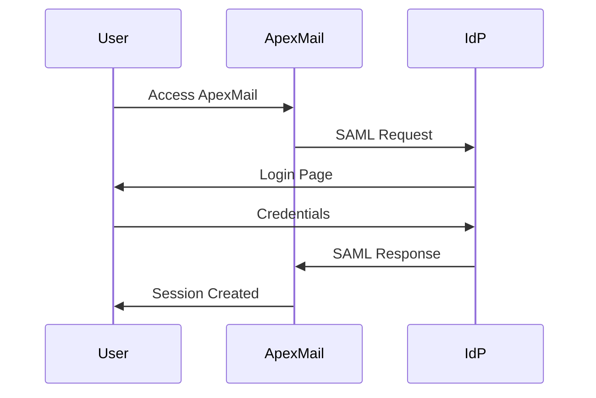
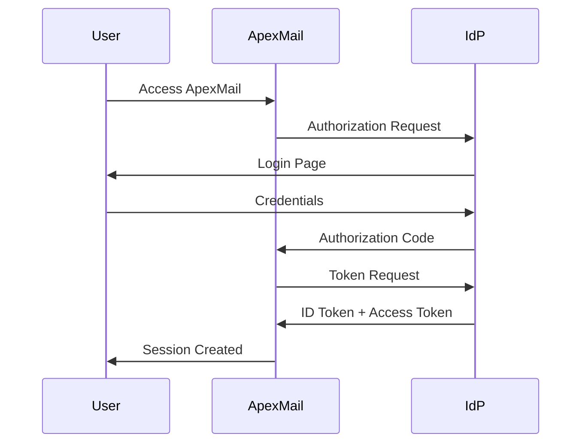

# Single Sign-On (SSO)

ApexMail supports enterprise Single Sign-On through both SAML 2.0 and OpenID Connect (OIDC) protocols.

## Overview

SSO allows your organization to:

- Authenticate users through your existing identity provider (IdP)
- Enforce your organization's authentication policies
- Automatically provision and deprovision users
- Enable Multi-Factor Authentication (MFA) through your IdP

## Supported Identity Providers

### SAML 2.0
- Okta
- Azure Active Directory
- OneLogin
- Ping Identity
- Google Workspace
- ADFS
- Custom SAML IdP

### OpenID Connect (OIDC)
- Okta
- Auth0
- Azure AD
- Google
- Keycloak
- Custom OIDC Provider

## Configuration

### SAML Setup

1. **Get ApexMail SAML Metadata**

```bash
curl https://api.apexmail.ee/enterprise/v1/sso/saml/metadata/{account_id}
```

Response:
```xml
<?xml version="1.0"?>
<EntityDescriptor xmlns="urn:oasis:names:tc:SAML:2.0:metadata" 
                  entityID="https://api.apexmail.ee/saml/{account_id}">
  <SPSSODescriptor>
    <AssertionConsumerService 
      Binding="urn:oasis:names:tc:SAML:2.0:bindings:HTTP-POST"
      Location="https://api.apexmail.ee/enterprise/v1/sso/saml/callback"/>
  </SPSSODescriptor>
</EntityDescriptor>
```

2. **Configure Your IdP**

Add ApexMail as a SAML application in your IdP with:
- **ACS URL**: `https://api.apexmail.ee/enterprise/v1/sso/saml/callback`
- **Entity ID**: `https://api.apexmail.ee/saml/{account_id}`
- **Name ID Format**: Email address

3. **Upload IdP Metadata to ApexMail**

```bash
curl -X POST https://api.apexmail.ee/enterprise/v1/sso/configure \
  -H "X-API-Key: YOUR_API_KEY" \
  -H "Content-Type: application/json" \
  -d '{
    "accountId": "acc_xxx",
    "provider": "saml",
    "ssoEnabled": true,
    "samlConfig": {
      "entryPoint": "https://your-idp.com/saml/sso",
      "certificate": "-----BEGIN CERTIFICATE-----\n...\n-----END CERTIFICATE-----",
      "issuer": "https://your-idp.com"
    },
    "allowedDomains": ["yourcompany.com"],
    "defaultRole": "member",
    "autoProvision": true
  }'
```

### OIDC Setup

1. **Register ApexMail in Your IdP**

Create an OIDC application with:
- **Redirect URI**: `https://api.apexmail.ee/enterprise/v1/sso/oidc/callback`
- **Scopes**: `openid email profile`

2. **Configure ApexMail**

```bash
curl -X POST https://api.apexmail.ee/enterprise/v1/sso/configure \
  -H "X-API-Key: YOUR_API_KEY" \
  -H "Content-Type: application/json" \
  -d '{
    "accountId": "acc_xxx",
    "provider": "oidc",
    "ssoEnabled": true,
    "oidcConfig": {
      "issuer": "https://your-idp.com",
      "clientId": "your-client-id",
      "clientSecret": "your-client-secret"
    },
    "allowedDomains": ["yourcompany.com"],
    "defaultRole": "member",
    "autoProvision": true
  }'
```

## User Provisioning

### Auto-Provisioning

When enabled, users are automatically created on first SSO login:

```json
{
  "autoProvision": true,
  "defaultRole": "member",
  "allowedDomains": ["yourcompany.com"]
}
```

### SCIM Provisioning

For advanced user lifecycle management, enable SCIM:

```bash
# Get SCIM endpoint
curl https://api.apexmail.ee/enterprise/v1/scim/config

# Response
{
  "scimBaseUrl": "https://api.apexmail.ee/enterprise/v1/scim",
  "authMethod": "api_key",
  "token": "scim_xxx"
}
```

## Authentication Flow

### SAML Flow



### OIDC Flow



## Session Management

### Session Lifetime

Configure session settings per account:

```json
{
  "sessionLifetime": 28800,
  "requireMFA": true,
  "allowPasswordFallback": false
}
```

### Single Logout (SLO)

For SAML, ApexMail supports Single Logout:

```bash
POST /enterprise/v1/sso/logout
{
  "sessionId": "sess_xxx"
}
```

## Security Best Practices

1. **Enable MFA** - Require MFA through your IdP
2. **Limit Domains** - Restrict SSO to specific email domains
3. **Disable Password Fallback** - Force SSO-only authentication
4. **Regular Audits** - Review SSO sessions and provisioned users
5. **Certificate Rotation** - Rotate SAML certificates regularly

## Troubleshooting

### Common Issues

**SAML Response Invalid**
- Verify certificate is correctly formatted
- Check clock skew between systems
- Ensure Name ID format matches configuration

**OIDC Token Invalid**
- Verify client ID and secret
- Check redirect URI matches exactly
- Ensure required scopes are granted

### Debug Mode

Enable debug logging for SSO:

```bash
curl -X PUT https://api.apexmail.ee/enterprise/v1/sso/config/{account_id} \
  -H "X-API-Key: YOUR_API_KEY" \
  -d '{"debugMode": true}'
```

## API Reference

| Endpoint | Method | Description |
|----------|--------|-------------|
| `/sso/configure` | POST | Configure SSO |
| `/sso/config/{accountId}` | GET | Get SSO configuration |
| `/sso/saml/login/{domain}` | GET | Initiate SAML login |
| `/sso/saml/callback` | POST | Process SAML response |
| `/sso/oidc/authorize/{domain}` | GET | Initiate OIDC login |
| `/sso/oidc/callback` | GET | Process OIDC callback |
| `/sso/logout` | POST | Single logout |
