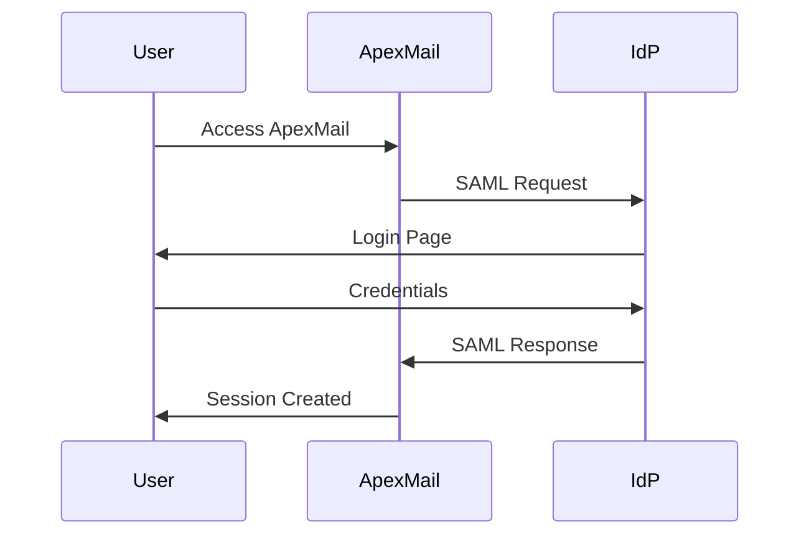
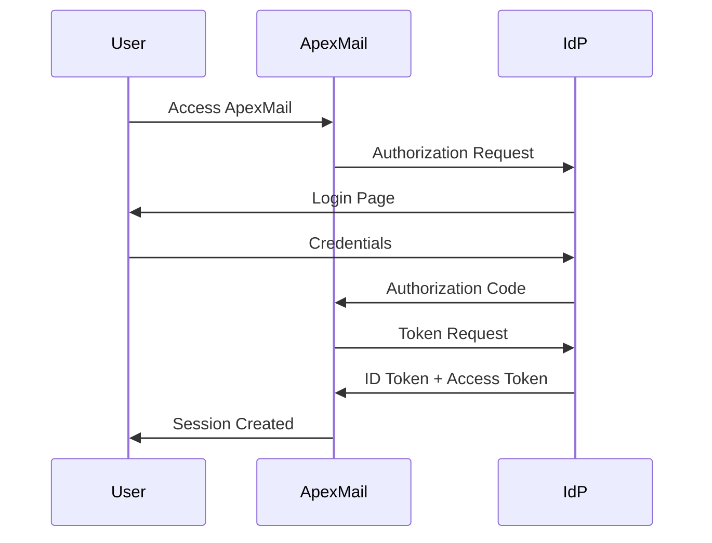

# Single Sign-On (SSO)

ApexMail supports enterprise Single Sign-On through both SAML 2.0 and OpenID Connect (OIDC) protocols.

> **Status: available.** Both flows are wired end-to-end in the enterprise
> service (`services/mail-server/crates/enterprise`): SP-initiated SAML with a
> full Assertion Consumer Service, and OIDC authorization-code login with PKCE,
> discovery, and JWKS-backed id_token validation. Every step is covered by
> router-level end-to-end tests (`routes::tests::saml_sso_completes_end_to_end_through_the_router`,
> `routes::tests::oidc_sso_completes_end_to_end_through_the_router`) and the
> signed-assertion coverage in `crates/enterprise/src/sso.rs`.

## Overview

SSO allows your organization to:

- Authenticate users through your existing identity provider (IdP)
- Enforce your organization's authentication policies
- Automatically provision and deprovision users
- Enable Multi-Factor Authentication (MFA) through your IdP

Every assertion / id_token is validated before a session is issued: XML-DSig
signature against your IdP's configured certificate, issuer and audience
checks, the assertion validity window with bounded clock skew, a per-tenant
replay guard for SAML, and (for OIDC) RS256-only verification against the
IdP's published JWKS with issuer, audience, and expiry checks. Sessions are
stored server-side with a configurable lifetime and can be swept with the
cleanup endpoint.

## Supported Identity Providers

### SAML 2.0
- Okta
- Azure Active Directory
- OneLogin
- Ping Identity
- Google Workspace
- ADFS
- Custom SAML IdP

### OpenID Connect (OIDC)
- Okta
- Auth0
- Azure AD
- Google
- Keycloak
- Custom OIDC Provider

## Configuration

### SAML Setup

1. **Get ApexMail's service-provider values**

ApexMail acts as the SP. Give your IdP these values (the defaults are
environment-driven — see `SAML_ENTITY_ID` / `SAML_ACS_URL` in
`.env.production.example`):

- **SP Entity ID**: `urn:apexmail:enterprise` (the `SAML_ENTITY_ID` default)
- **ACS URL**: `https://enterprise.apexmail.ee/sso/acs/{your-domain}`
  (the domain you will initiate logins for; a domain-less variant at
  `https://enterprise.apexmail.ee/sso/acs` resolves your domain from the
  RelayState, which the login initiation sets)
- **Binding**: HTTP-POST

2. **Configure Your IdP**

Add ApexMail as a SAML application in your IdP with:
- **Entity ID / Issuer**: your IdP's entity ID (e.g. `https://idp.yourcompany.com/metadata`)
- **Name ID Format**: Email address
- **Attribute statements**: `email`, `group` (optional), `displayName` (optional)

3. **Upload IdP Metadata to ApexMail**

```bash
curl -X POST https://enterprise.apexmail.ee/sso/configure \
  -H "Authorization: Bearer YOUR_API_TOKEN" \
  -H "Content-Type: application/json" \
  -d '{
    "tenant_id": "your_tenant_id",
    "provider_type": "saml",
    "domain": "yourcompany.com",
    "enabled": true,
    "entity_id": "https://idp.yourcompany.com/metadata",
    "sso_url": "https://idp.yourcompany.com/sso",
    "certificate": "-----BEGIN CERTIFICATE-----\n...\n-----END CERTIFICATE-----",
    "enforce_sso": true,
    "session_duration_hours": 8
  }'
```

4. **Log in**

Point the browser at `GET /sso/login/saml/yourcompany.com`. ApexMail builds
the AuthnRequest and redirects to your IdP with the tenant domain in
`RelayState`. Your IdP posts the signed response to the ACS
(`POST /sso/acs/{domain}`), where the assertion is verified and a session is
issued.

### OIDC Setup

1. **Register ApexMail in Your IdP**

Create an OIDC application with:
- **Redirect URI**: `https://enterprise.apexmail.ee/sso/callback/oidc/your-domain`
  (a domain-less variant at `.../sso/callback/oidc` takes the domain from the
  single-use state — set `OIDC_REDIRECT_URI` to whichever shape you register)
- **Scopes**: `openid email profile` (the `OIDC_SCOPES` default)

2. **Configure ApexMail**

```bash
curl -X POST https://enterprise.apexmail.ee/sso/configure \
  -H "Authorization: Bearer YOUR_API_TOKEN" \
  -H "Content-Type: application/json" \
  -d '{
    "tenant_id": "your_tenant_id",
    "provider_type": "oidc",
    "domain": "yourcompany.com",
    "enabled": true,
    "oidc_client_id": "your-client-id",
    "oidc_client_secret": "your-client-secret",
    "oidc_issuer": "https://idp.yourcompany.com",
    "enforce_sso": true
  }'
```

The client secret is encrypted at rest with the deployment's
`SSO_ENCRYPTION_KEY` and never returned by the API.

3. **Log in**

Point the browser at `GET /sso/login/oidc/yourcompany.com`. ApexMail stages a
single-use `state` plus a PKCE `code_verifier` (S256 challenge) and redirects
to your IdP's authorize endpoint. Your IdP redirects back to the callback with
the code; ApexMail discovers the token endpoint from
`{issuer}/.well-known/openid-configuration`, exchanges the code with the
persisted verifier, validates the `id_token` against your IdP's JWKS, and
issues the session.

## User Provisioning

### Auto-Provisioning

Users are provisioned automatically on first SSO login: the validated
identity (SAML NameID/attributes or the id_token's `sub`/`email`/`name`
claims) creates the SSO session record, and the callback response reports
`is_new_user: true` for the first login of an external user id. Subsequent
logins for the same user are recognized as returning users.

The `domain` configured on the tenant's SSO row scopes which email domain
logs in through which IdP; the login is initiated per domain
(`/sso/login/saml/{domain}`, `/sso/login/oidc/{domain}`).

### SCIM Provisioning

For advanced user lifecycle management, enable SCIM:

```bash
# Get SCIM endpoint
curl https://enterprise.apexmail.ee/scim/config

# Response
{
  "scimBaseUrl": "https://enterprise.apexmail.ee/scim",
  "authMethod": "api_key",
  "token": "scim_xxx"
}
```

## Authentication Flow

### SAML Flow


```mermaid
sequenceDiagram
    User->>ApexMail: Access ApexMail
    ApexMail->>IdP: SAML Request
    IdP->>User: Login Page
    User->>IdP: Credentials
    IdP->>ApexMail: SAML Response
    ApexMail->>User: Session Created
```

### OIDC Flow


```mermaid
sequenceDiagram
    User->>ApexMail: Access ApexMail
    ApexMail->>IdP: Authorization Request
    IdP->>User: Login Page
    User->>IdP: Credentials
    IdP->>ApexMail: Authorization Code
    ApexMail->>IdP: Token Request
    IdP->>ApexMail: ID Token + Access Token
    ApexMail->>User: Session Created
```

## Session Management

### Session Lifetime

Sessions are stored server-side and expire after the configured per-tenant
duration. Pass `session_duration_hours` in the `/sso/configure` body
(the default is 8):

```json
{
  "session_duration_hours": 8
}
```

Validate a session at any time with `GET /sso/validate` (bearer session
token); expired sessions fail validation and are removed by the cleanup sweep
(`POST /sso/cleanup`, admin token required).

### Single Logout (SLO)

[roadmap] SAML single logout is not part of the login flows today. A SLO
endpoint (the `SAML_SLO_URL` deployment setting already exists) and
per-session revocation are planned; sessions currently expire per the
configured lifetime, and enforced tenants keep `enforce_sso` on so password
fallback stays disabled.

## Security Best Practices

1. **Enable MFA** - Require MFA through your IdP
2. **Limit Domains** - Restrict SSO to specific email domains
3. **Disable Password Fallback** - Force SSO-only authentication
4. **Regular Audits** - Review SSO sessions and provisioned users
5. **Certificate Rotation** - Rotate SAML certificates regularly

## Troubleshooting

### Common Issues

**SAML Response Invalid**
- Verify certificate is correctly formatted
- Check clock skew between systems
- Ensure Name ID format matches configuration

**OIDC Token Invalid**
- Verify client ID and secret
- Check redirect URI matches exactly
- Ensure required scopes are granted

### Debug Mode

Validation refusals are logged server-side with structured fields (the
specific check that failed: signature, issuer, audience, validity window, or
replay) via `tracing`, so point your log sink at the enterprise service and
reproduce the login. Verify the stored configuration with:

```bash
curl https://enterprise.apexmail.ee/sso/config/domain/yourcompany.com \
  -H "Authorization: Bearer YOUR_API_TOKEN"
```

The response is sanitized — secret material (encrypted private key, client
secret, SAML certificate) never leaves the server.

## API Reference

All Enterprise SSO endpoints are served by the enterprise service under the
`/sso` prefix (see `services/mail-server/crates/enterprise/src/routes.rs`).
The login and callback endpoints are the browser-facing halves of the flows
and are reachable without an API bearer token; configuration and maintenance
endpoints require one.

| Endpoint | Method | Description |
|----------|--------|-------------|
| `/sso/configure` | POST | Configure SSO for a tenant (SAML or OIDC) |
| `/sso/config/{tenant_id}` | GET | Get SSO configuration |
| `/sso/config/domain/{domain}` | GET | Get SSO configuration by email domain |
| `/sso/login/saml/{domain}` | GET | Initiate SAML login (AuthnRequest redirect) |
| `/sso/acs/{domain}` | POST | SAML Assertion Consumer Service (issues the session); `/sso/acs` takes the domain from RelayState |
| `/sso/login/oidc/{domain}` | GET | Initiate OIDC login (state + PKCE redirect) |
| `/sso/callback/oidc/{domain}` | GET | OIDC callback: code exchange + id_token validation (issues the session); `/sso/callback/oidc` takes the domain from the state |
| `/sso/validate` | GET | Validate an SSO session (bearer session token) |
| `/sso/cleanup` | POST | Purge expired SSO sessions (admin) |
