# ApexMail — Complete Repository Architecture Map

> Generated from recursive exploration of `/Users/sabelakhoua/IdeaProjects/ApexMail`
> Date: 2026-05-11

---

## 1. Repository Overview

**ApexMail** is a Rust-first transactional email delivery platform with SSR browser surfaces, tracking, analytics, and mail transport services. It operates as a Rust monorepo with a Zola-based static marketing site, multiple language SDKs, and comprehensive infrastructure-as-code.

**Tech Stack:** Rust (Cargo workspace), PostgreSQL 16+, Redis 7+, ClickHouse, Zola (static site generator), Docker Compose, Kubernetes (Helm/Kustomize), Prometheus/Grafana/Loki/Tempo (observability)

---

## 2. Top-Level Directory Map

```
ApexMail/
├── .github/              # CI/CD workflows, Dependabot, PR templates
├── apps/                 # Application packages (marketing site, AI training)
├── data/                 # Training datasets, golden QA data, system prompts
├── deploy/               # Infrastructure: Docker, K8s, Helm, Nginx, Monitoring
├── docs/                 # Documentation: API, architecture, ADRs, operations, security
├── packages/             # SDK packages (Go, Java, PHP, Python, Ruby)
├── reports/              # Visual parity screenshots, browser smoke test results
├── services/             # Core mail-server Rust workspace (57 crates)
├── tools/                # Audit scripts, fix tools, migration SQL, dev scripts
├── .env.example          # Environment variable template (119 lines)
├── .env.production.example
├── docker-compose.yml    # Dev Docker Compose (22 services)
├── docker-compose.prod.yml  # Production overrides (Nginx, TLS, replicas)
├── docker-compose.override.yml
├── .gitleaks.toml        # Secret scanning config
├── .pre-commit-config.yaml
├── CHANGELOG.md
├── CODEOWNERS
├── CONTRIBUTING.md
├── faults.md             # Known faults/issue tracker
└── README.md
```

---

## 3. Application Packages (`apps/`)

### 3.1 Marketing Site — Zola Static Site (`apps/marketing-zola/`)

A static marketing website built with [Zola](https://www.getzola.org/) SSG + Tailwind CSS.

```
marketing-zola/
├── config.toml           # Zola site configuration
├── Dockerfile            # Multi-stage build Dockerfile
├── tailwind.config.js
├── tailwindcss           # Tailwind CLI binary
├── content/              # Markdown content pages
│   ├── _index.md
│   ├── acceptable-use/
│   ├── api-console/
│   ├── case-studies/
│   ├── compare/          # Competitor comparisons: postmark, resend, sendgrid
│   ├── compliance/
│   ├── contact/
│   ├── cookies/          # i18n: de, es, fr, en
│   ├── docs/             # Docs: alerts, analytics, api, sdks, webhooks
│   ├── dpa/
│   ├── features/
│   ├── forensic/
│   ├── inbox-placement/
│   ├── pricing/          # Pricing calculator
│   ├── privacy/
│   ├── private-cloud/
│   ├── secure-email-for-regulated-saas/
│   ├── sla/
│   ├── status/
│   └── terms/
├── i18n/                 # Translations: de.po, en.po, es.po, fr.po
├── static/               # Static assets served directly
│   ├── css/              # input.css, no-js.css, style.css, styles.css, tailwind.css
│   ├── fonts/            # Fraunces, Inter, JetBrainsMono (variable fonts)
│   ├── images/           # og-image.svg
│   ├── js/               # apexmail-site.js
│   └── patterns/         # hero-grid.svg
├── templates/            # Zola Tera templates
│   ├── base.html
│   ├── home.html
│   ├── pricing.html
│   ├── features.html
│   ├── compare.html
│   ├── api-console.html
│   ├── calculator.html
│   ├── case-studies.html
│   ├── compliance.html
│   ├── forensic.html
│   ├── private-cloud.html
│   ├── prose.html
│   ├── 404.html
│   └── partials/         # Reusable template components
│       ├── analytics.html
│       ├── cookie-consent.html
│       ├── footer.html
│       ├── header.html
│       └── generated/    # Server-generated islands (pricing calculator, etc.)
└── public/               # Built static site output (also committed)
```

### 3.2 AI Training Pipeline (`apps/ai/training/`)

Machine learning training pipeline for email analytics (send-time optimization, churn prediction, etc.)

```
ai/training/
├── config.yaml                      # Training configuration
├── pipeline.sh                      # End-to-end pipeline orchestration
├── train.py                         # Main training script
├── training_data.py                 # Data loading/preprocessing
├── generate_dataset.py              # Dataset generation
├── generate_gap_training.py         # Gap analysis training data
├── generate_recovered_training.py   # Recovered/failed email training
├── evaluate.py                      # Model evaluation
├── validate_pipeline.py             # Pipeline validation
├── validate_pricing.py              # Pricing drift validation
├── upload.sh                        # Upload trained models
├── test_agent.py                    # Test agent
├── run_test_agent.py                # Run test agent
├── stress_test.py                   # Stress testing
├── stress_test_agent.py             # Stress test agent
├── run_stress_r15.py                # R15 stress test
├── stress_test_recovered.py         # Recovered email stress test
├── new_customer_profiles.py         # Customer profile generation
├── extract_all_recovered.py         # Extract recovered emails
├── extract_full_recovered.py        # Full recovery extraction
├── integrate_recovered.py           # Integrate recovered data
├── prompts_v2.py                    # LLM prompts v2
├── common_paths.py                  # Shared path utilities
├── TRAINING_REPORT.md               # Training report
└── upload.sh                        # Upload artifacts
```

---

## 4. Core Mail Server — Rust Workspace (`services/mail-server/`)

The heart of the platform — a Cargo workspace with **57 crates**.

### 4.1 Workspace Configuration

| File | Purpose |
|------|---------|
| [`Cargo.toml`](services/mail-server/Cargo.toml) | Workspace manifest: 57 members, shared dependencies |
| [`Cargo.lock`](services/mail-server/Cargo.lock) | Locked dependency versions |
| [`Dockerfile`](services/mail-server/Dockerfile) | Multi-stage build (targets: api-server, enterprise, smtp-edge, observability, etc.) |
| [`docker-compose.yml`](services/mail-server/docker-compose.yml) | Dev compose for mail-server |
| [`deny.toml`](services/mail-server/deny.toml) | Cargo deny configuration |
| [`coverage.toml`](services/mail-server/coverage.toml) | Code coverage config |
| [`mutants.toml`](services/mail-server/mutants.toml) | Mutation testing config |
| [`.dockerignore`](services/mail-server/.dockerignore) | Docker build context exclusions |

### 4.2 Runtime Services (Standalone Binaries)

| # | Crate | Description | Binary |
|---|-------|-------------|--------|
| 1 | [`api-server`](services/mail-server/crates/api-server/) | REST API + SSR web + control-plane surfaces (port 3000/8080) | `api-server` |
| 2 | [`tracking-service`](services/mail-server/crates/tracking-service/) | Open pixel, click tracking, unsubscribe (port 3001) | `tracking-service` |
| 3 | [`enterprise`](services/mail-server/crates/enterprise/) | Enterprise-only routes: SSO, sub-accounts, whitelabel, QBR, compliance (port 3002) | `enterprise-server` |
| 4 | [`mta`](services/mail-server/crates/mta/) | SMTP mail transfer agent (ports 25, 587, 465) | `mta` |
| 5 | [`smtp-edge`](services/mail-server/crates/smtp-edge/) | SMTP edge proxy/server | `smtp-edge` |
| 6 | [`submission`](services/mail-server/crates/submission/) | SMTP submission service (port 587) | `submission` |
| 7 | [`outbound-queue`](services/mail-server/crates/outbound-queue/) | Outbound email queue processor | `outbound-queue` |
| 8 | [`worker-processors`](services/mail-server/crates/worker-processors/) | Background job processing (analytics) | `worker` |
| 9 | [`compliance`](services/mail-server/crates/compliance/) | Compliance service (GDPR, HIPAA, SOC2, DPA) | `compliance-server` |
| 10 | [`isolation`](services/mail-server/crates/isolation/) | Multi-tenant data isolation service | `isolation-server` |
| 11 | [`ha`](services/mail-server/crates/ha/) | High-availability: multi-region, circuit breaker, replication | `ha-server` |
| 12 | [`devex-service`](services/mail-server/crates/devex-service/) | Developer experience service (SDK mgmt, webhook tester, onboarding) | `devex-server` |
| 13 | [`observability-service`](services/mail-server/crates/observability-service/) | Metrics, tracing, alerting, SLO management | `observability-server` |
| 14 | [`ops-service`](services/mail-server/crates/ops-service/) | Operations: health, incidents, status, warmup, trust | `ops-server` |
| 15 | [`billing-service`](services/mail-server/crates/billing-service/) | Billing: invoicing, subscriptions, metering, VAT, Stripe webhooks | `billing-server` |
| 16 | [`ai-service`](services/mail-server/crates/ai-service/) | AI inference: send-time optimization, bandits, content analysis | `ai-server` |
| 17 | [`ai-embeddings`](services/mail-server/crates/ai-embeddings/) | Vector embeddings service (chunking, vector store, search) | `ai-embeddings-server` |
| 18 | [`pdf-renderer`](services/mail-server/crates/pdf-renderer/) | PDF generation via Typst (invoices, reports, DPAs) | `pdf-renderer` |
| 19 | [`template-renderer`](services/mail-server/crates/template-renderer/) | Email template rendering (sandboxed, transpiler) | `template-renderer` |
| 20 | [`inbox-placement`](services/mail-server/crates/inbox-placement/) | Inbox placement testing (seed accounts, IMAP polling) | `inbox-placement` |
| 21 | [`sales-autopilot`](services/mail-server/crates/sales-autopilot/) | Sales CRM: leads, calendar, enrichment, scrapers | `sales-autopilot` |
| 22 | [`mailstore-core`](services/mail-server/crates/mailstore-core/) | Mail storage service (encryption, models, storage) | `mailstore-core` |

### 4.3 Library Crates (Non-executable)

| # | Crate | Description |
|---|-------|-------------|
| 23 | [`apexmail-db`](services/mail-server/crates/apexmail-db/) | Database layer: pool, migrations, transactions, types |
| 24 | [`apexmail-lib`](services/mail-server/crates/apexmail-lib/) | Shared library: crypto, cache, MFA, PII, validation, error codes |
| 25 | [`mail-common`](services/mail-server/crates/mail-common/) | Common mail types: config, errors, hot-config, internal auth, PII, SSRF, warmup |
| 26 | [`mail-proto`](services/mail-server/crates/mail-proto/) | Protobuf definitions (gRPC mail protocol) |
| 27 | [`billing-common`](services/mail-server/crates/billing-common/) | Shared billing: audit, CSV, proration, VAT rates |
| 28 | [`queue-provider`](services/mail-server/crates/queue-provider/) | Queue abstraction: provider, scheduler, schema |
| 29 | [`ui-foundation`](services/mail-server/crates/ui-foundation/) | Leptos UI foundation: components, icons, tokens, SSR, routing, pixel parity |
| 30 | [`rate-limiter`](services/mail-server/crates/rate-limiter/) | Rate limiting: governor, sliding window, Redis-backed, keyed |
| 31 | [`dns-resolver`](services/mail-server/crates/dns-resolver/) | DNS resolution: caching, records, lookup |
| 32 | [`analytics`](services/mail-server/crates/analytics/) | Email analytics: ClickHouse engine, churn, engagement, send-time optimization |
| 33 | [`bounce-analytics`](services/mail-server/crates/bounce-analytics/) | Bounce processing: aggregation, classification |
| 34 | [`email-grader`](services/mail-server/crates/email-grader/) | Email grade/scoring: network checks, crypto, scoring |
| 35 | [`pattern-matcher`](services/mail-server/crates/pattern-matcher/) | Pattern matching: bot patterns, rules, spam patterns |
| 36 | [`edge-cases`](services/mail-server/crates/edge-cases/) | Edge case handling |

### 4.4 Security & Protection Crates

| # | Crate | Description |
|---|-------|-------------|
| 37 | [`ddos-protection`](services/mail-server/crates/ddos-protection/) | DDoS mitigation: adaptive, cost-based, ML cache, reputation, SMTP protection |
| 38 | [`waf-engine`](services/mail-server/crates/waf-engine/) | Web Application Firewall: SQL analyzer, XSS, JSON/GraphQL, fast-path detection |
| 39 | [`ids-engine`](services/mail-server/crates/ids-engine/) | Intrusion Detection: signature-based, connection tracking, protocol analysis |
| 40 | [`spam-filter`](services/mail-server/crates/spam-filter/) | Spam filtering: Bayesian, content scoring, header/URL analysis |
| 41 | [`sandbox`](services/mail-server/crates/sandbox/) | Email attachment sandbox: dynamic analysis, file inspection, policy |
| 42 | [`ato-protection`](services/mail-server/crates/ato-protection/) | Account Takeover protection: behavior, geo, TLS fingerprint, lockout, session |
| 43 | [`dlp-engine`](services/mail-server/crates/dlp-engine/) | Data Loss Prevention: PII detection, content policy, entropy, attachment scanning |
| 44 | [`threat-intel`](services/mail-server/crates/threat-intel/) | Threat intelligence: STIX/TAXII, reputation, domain/IP blocklists |
| 45 | [`fingerprint`](services/mail-server/crates/fingerprint/) | HTTP/TLS fingerprinting: JA4, HTTP2, database |

### 4.5 Test & Benchmark Crates

| # | Crate | Description |
|---|-------|-------------|
| 46 | [`smoke-tests`](services/mail-server/crates/smoke-tests/) | Smoke test suite |
| 47 | [`functional-tests`](services/mail-server/crates/functional-tests/) | Functional test suite |
| 48 | [`integration-tests`](services/mail-server/crates/integration-tests/) | Integration test suite |
| 49 | [`perf-tests`](services/mail-server/crates/perf-tests/) | Performance benchmarks (AI, billing, crypto, pattern, sales, services) |
| 50 | [`fuzz-tests`](services/mail-server/crates/fuzz-tests/) | Fuzz testing |
| 51 | [`load-tests`](services/mail-server/crates/load-tests/) | Load tests (concurrent, parallel, stress, throughput, async_network, isolation) + k6 scripts |

### 4.6 API Server Route Map (`api-server`)

The [`api-server`](services/mail-server/crates/api-server/src/routes/) crate serves the REST API with these route modules:

**Customer-facing routes:**
| Route Module | Endpoints |
|---|---|
| `account.rs` | Account management |
| `ai_insights.rs` | AI-powered insights |
| `analytics.rs` | Email analytics |
| `auth.rs` | Authentication |
| `automations.rs` | Automation workflows |
| `billing.rs` | Billing/payments |
| `campaigns.rs` | Campaign management |
| `contacts.rs` | Contact management |
| `csrf.rs` | CSRF protection |
| `dashboard.rs` | User dashboard |
| `dedicated_ips.rs` | Dedicated IP management |
| `domains.rs` | Domain management |
| `events.rs` | Email events |
| `forgot_password.rs` | Password reset |
| `health.rs` | Health checks |
| `impersonate.rs` | Admin impersonation |
| `lists.rs` | Mailing lists |
| `messages.rs` | Email messages |
| `scim.rs` | SCIM provisioning |
| `self_hosted_bounces.rs` | Self-hosted bounce handling |
| `ses_notifications.rs` | SES notification webhooks |
| `session.rs` | Session management |
| `sso.rs` | Single Sign-On |
| `stream_tokens.rs` | Stream tokens |
| `support.rs` | Support tickets |
| `suppressions.rs` | Suppression management |
| `telemetry.rs` | Telemetry endpoints |
| `templates.rs` | Email templates |
| `webhooks.rs` | Webhook management |

**Admin routes:**
| Route Module | Description |
|---|---|
| `admin/analytics.rs` | Admin analytics |
| `admin/analytics_export.rs` | Analytics export |
| `admin/audit.rs` | Audit log |
| `admin/autopilot.rs` | Sales autopilot management |
| `admin/calendar.rs` | Calendar |
| `admin/campaigns.rs` | Campaign admin |
| `admin/compliance_overview.rs` | Compliance dashboard |
| `admin/content.rs` | Content management |
| `admin/crm_leads.rs` | CRM leads |
| `admin/dashboard.rs` | Admin dashboard |
| `admin/features.rs` | Feature flags |
| `admin/gdpr.rs` | GDPR management |
| `admin/inbox.rs` | Inbox admin |
| `admin/leads_discovery.rs` | Lead discovery |
| `admin/proxy.rs` | Proxy admin |
| `admin/revenue.rs` | Revenue management |
| `admin/risk.rs` | Risk management |
| `admin/sales.rs` | Sales management |
| `admin/secrets.rs` | Secrets management |
| `admin/support.rs` | Support admin |
| `admin/support_analytics.rs` | Support analytics |
| `admin/system_health.rs` | System health |
| `admin/tenants.rs` | Tenant management |
| `admin/vat.rs` | VAT management |
| `admin/warmup.rs` | IP warmup management |

**Middleware:**
| Module | Purpose |
|---|---|
| `middleware/auth.rs` | Authentication/authorization |
| `middleware/ddos.rs` | DDoS protection |
| `middleware/idempotency.rs` | Idempotency keys |
| `middleware/metrics.rs` | Request metrics |
| `middleware/rate_limiter.rs` | Rate limiting |
| `middleware/request_logger.rs` | Request logging |

### 4.7 MTA Crate (`mta`)

SMTP mail transfer agent with full email authentication:

| Module | Purpose |
|---|---|
| `src/auth/arc.rs` | ARC (Authenticated Received Chain) |
| `src/auth/bimi.rs` | BIMI (Brand Indicators for Message Identification) |
| `src/auth/dane.rs` | DANE (DNS-based Authentication of Named Entities) |
| `src/auth/email_authentication.rs` | Core email auth (SPF, DKIM, DMARC) |
| `src/auth/mta_sts.rs` | MTA-STS (SMTP MTA Strict Transport Security) |
| `src/postmaster/` | Postmaster tools: reputation aggregation, Google Postmaster, SNDS |
| `src/servers/inbound.rs` | Inbound SMTP |
| `src/servers/bounce.rs` | Bounce processing |
| `src/servers/feedback_loop.rs` | FBL (Feedback Loop) |

### 4.8 Database Migrations

**Mail-server schema migrations** ([`services/mail-server/migrations/`](services/mail-server/migrations/)):
- 51 migration files (001-051)
- Covers: initial schema, mailstore, dedicated IPs, hybrid infrastructure, enterprise billing, VAT, SOC2/HIPAA/trust portal, bounce analytics, seed accounts, compliance, AI send-time cache, partitioning, performance indexes

**Tool-level migrations** ([`tools/migrations/`](tools/migrations/)):
- 16 migration files (001-016)
- Covers: initial schema, queue jobs, inbound processing, sales autopilot CRM, tenant IDs, partitioning, control plane tables, ops/status/trust, campaigns/contacts/automations, billing/auth

**Mailstore-core migrations** ([`services/mail-server/crates/mailstore-core/migrations/`](services/mail-server/crates/mailstore-core/migrations/)):
- 2 migration files: init, UID backfill

---

## 5. Infrastructure & Deployment (`deploy/`)

### 5.1 Docker Compose

| File | Purpose |
|---|---|
| [`docker-compose.yml`](docker-compose.yml) | 22 services: postgres, redis, api-server, enterprise, mta, tracking, observability, otel-collector, tempo, pdf-renderer, mailpit, clickhouse, prometheus, grafana, loki, alertmanager, postgres-exporter, redis-exporter, clickhouse-exporter, node-exporter, blackbox-exporter, synthetic-monitor |
| [`docker-compose.prod.yml`](docker-compose.prod.yml) | Production overrides: Nginx reverse proxy with TLS, no host DB ports, replicas, stricter limits |
| [`docker-compose.override.yml`](docker-compose.override.yml) | Dev overrides |

### 5.2 Nginx

| File | Purpose |
|---|---|
| [`deploy/nginx/nginx.conf`](deploy/nginx/nginx.conf) | Reverse proxy config (TLS termination, routing) |
| [`deploy/nginx/ssl/dhparam.pem`](deploy/nginx/ssl/dhparam.pem) | Diffie-Hellman parameters |
| [`deploy/nginx/ssl/README.md`](deploy/nginx/ssl/README.md) | SSL setup instructions |

### 5.3 Kubernetes (Kustomize)

| Directory | Components |
|---|---|
| [`deploy/k8s/api-server/`](deploy/k8s/api-server/) | Deployment, HPA, network-policy, PDB, service, serviceaccount |
| [`deploy/k8s/enterprise/`](deploy/k8s/enterprise/) | Same set for enterprise service |
| [`deploy/k8s/mta/`](deploy/k8s/mta/) | Same set for MTA |
| [`deploy/k8s/tracking-service/`](deploy/k8s/tracking-service/) | Same set for tracking |
| [`deploy/k8s/worker/`](deploy/k8s/worker/) | Same set for worker |
| [`deploy/k8s/observability/`](deploy/k8s/observability/) | OTEL collector, Prometheus rules |
| [`deploy/k8s/policies/`](deploy/k8s/policies/) | Audit policy, configmap/secret guardrails, priority classes |
| [`deploy/k8s/configmap.yaml`](deploy/k8s/configmap.yaml) | Shared ConfigMap |
| [`deploy/k8s/kustomization.yaml`](deploy/k8s/kustomization.yaml) | Kustomize root |
| [`deploy/k8s/namespace.yaml`](deploy/k8s/namespace.yaml) | Namespace definition |
| [`deploy/k8s/secrets.template.yaml`](deploy/k8s/secrets.template.yaml) | Secrets template |

### 5.4 Helm Chart

| File | Purpose |
|---|---|
| [`deploy/helm/apexmail/Chart.yaml`](deploy/helm/apexmail/Chart.yaml) | Chart metadata |
| [`deploy/helm/apexmail/Chart.lock`](deploy/helm/apexmail/Chart.lock) | Dependency lock |
| [`deploy/helm/apexmail/values.yaml`](deploy/helm/apexmail/values.yaml) | Default values |
| [`deploy/helm/apexmail/values.schema.json`](deploy/helm/apexmail/values.schema.json) | Values JSON schema |
| **Dependencies:** clickhouse-6.3.3.tgz, postgresql-15.5.38.tgz, redis-19.6.4.tgz |
| **Templates:** api-server, enterprise, mta, tracking, worker deployments/services; configmap, ingress, HPA, PDB, network policy, service account, servicemonitor, tempo, post-start-hook |

### 5.5 Monitoring & Observability

| Component | Config Location |
|---|---|
| **Prometheus** | [`deploy/prometheus.yml`](deploy/prometheus.yml), [`deploy/alerting-rules.yml`](deploy/alerting-rules.yml), [`deploy/prometheus/alerts/`](deploy/prometheus/alerts/) (api-alerts, infrastructure-alerts) |
| **Grafana** | [`deploy/grafana/dashboards/`](deploy/grafana/dashboards/) — 13 dashboards (api-performance, business-kpis, database, infrastructure-overview, mta-overview, network-overview, redis, smtp-performance, system-resources, tracking-overview, worker-overview) |
| **Loki** | [`deploy/loki/loki-config.yaml`](deploy/loki/loki-config.yaml) |
| **Tempo** | [`deploy/tempo/tempo.yaml`](deploy/tempo/tempo.yaml) |
| **Alertmanager** | [`deploy/alertmanager.yml`](deploy/alertmanager.yml) |
| **Blackbox** | [`deploy/blackbox.yml`](deploy/blackbox.yml) |
| **OTEL Collector** | [`deploy/otel-collector/config.yaml`](deploy/otel-collector/config.yaml) |
| **Synthetic Monitor** | [`deploy/synthetic-monitor/`](deploy/synthetic-monitor/) (Python probe + Dockerfile) |
| **ClickHouse Exporter** | [`deploy/clickhouse-exporter/`](deploy/clickhouse-exporter/) (Python exporter + Dockerfile) |

---

## 6. SDK Packages (`packages/`)

| SDK | Language | Package Manager | Key Files |
|-----|----------|----------------|-----------|
| [`sdk-go`](packages/sdk-go/) | Go | go.mod | `apexmail.go` — Client, Envelope, Emails, Suppressions, Templates, Resources |
| [`sdk-java`](packages/sdk-java/) | Java | Maven (pom.xml) | `ApexMailClient.java`, `Emails.java`, `Domains.java`, `Suppressions.java`, `Templates.java`, `Webhooks.java`, `Analytics.java`, `Events.java`, `APIKeys.java` |
| [`sdk-php`](packages/sdk-php/) | PHP | Composer | `Client.php`, `Resources/` — Analytics, ApiKeys, Domains, Emails, Events, Suppressions, Templates, Webhooks |
| [`sdk-python`](packages/sdk-python/) | Python | pyproject.toml | `apexmail/` — client, models, exceptions, webhooks, `resources/` — analytics, api_keys, domains, emails, events, suppressions, templates, webhooks |
| [`sdk-ruby`](packages/sdk-ruby/) | Ruby | gemspec | `lib/apexmail.rb` |

---

## 7. Documentation (`docs/`)

### 7.1 Architecture Decision Records (`docs/adr/`)

| ADR | Decision |
|-----|----------|
| 0001 | Database choice (PostgreSQL) |
| 0002 | MTA stack |
| 0003 | Authentication and authorization |
| 0004 | Caching strategy |
| 0005 | SDK generation and versioning |
| 0006 | Testing strategy |
| 0007 | SDK design philosophy |
| 0008 | Multi-tenant architecture |
| 0009 | Observability architecture |
| 0010 | Security architecture |
| 0011 | Dual-delivery SES primary |
| 0015 | Email worker pipeline |

### 7.2 API Documentation (`docs/api/`)

| File | Description |
|---|---|
| [`openapi.yaml`](docs/api/openapi.yaml) | Full OpenAPI 3.0 specification |
| `endpoints/` | Per-endpoint docs: account, analytics, auth, automations, billing, campaigns, contacts, dedicated-ips, domains, events, health, lists, messages, scim, support, suppressions, templates, webhooks |
| `authentication.md` | Auth methods |
| `errors.md` | Error codes |
| `rate-limits.md` | Rate limiting |
| `webhooks.md` | Webhook system |
| `streaming.md` | Streaming API |
| `inbox-placement.md` | Inbox placement API |
| `sdk-reference.md` | SDK reference |
| `system-health.md` | Health check API |
| `changelog.md` | API changelog |

### 7.3 Architecture Docs (`docs/architecture/`)

Key documents: overview, data-flow, delivery-transport, hybrid-email-infrastructure, mta-configuration, outbound-delivery, queue-system, rate-limit-budgets, rate-limit-budget-enforcement, ai-pipeline, billing-lifecycle, cache-governance, control-plane-data-contracts, database-partitioning, redis-cluster-migration, sales-autopilot

### 7.4 Other Documentation

| Directory | Content |
|---|---|
| `docs/compliance/` | GDPR, HIPAA, SOC2, AUP, BAA, data retention, incident response, vulnerability management |
| `docs/deployment/` | Helm, configuration, quickstart, SES setup, Hetzner checklist |
| `docs/development/` | Contributing, style system, UI migration plans, navigation taxonomy, route inventory |
| `docs/enterprise/` | Private cloud, SSO, whitelabel, sub-accounts, compliance, QBR, log streaming |
| `docs/evaluation/` | Canary deployment, load testing, staging environment, post-mortem template |
| `docs/marketing/` | Pricing |
| `docs/operations/` | Monitoring, on-call, SLO management, DR, runbooks (incident response, crypto incidents) |
| `docs/security/` | RBAC, data protection, email auth, HSTS, mCaptcha, PGP, vulnerability SLA, secrets |
| `docs/tool-contracts/` | ClickHouse, Hetzner, PostgreSQL, Prometheus, Redis, SES, Stripe, Zone.ee |
| `docs/user-guide/` | Getting started, contacts, delivery options, inbox placement, troubleshooting, glossary |
| `docs/migration/` | API contract baselines |

---

## 8. CI/CD Workflows (`.github/workflows/`)

| Workflow | Trigger | Purpose |
|---|---|---|
| `deploy.yml` | Push/PR | Build and deploy |
| `rust-check.yml` | Push/PR | Rust compilation and lint checks |
| `rust-panic-paths.yml` | Push/PR | Check for unreachable panic paths |
| `sqlx-migration-validation.yml` | Push/PR | Validate SQLx migrations |
| `security-audit.yml` | Scheduled | Security vulnerability audit |
| `mutation-testing.yml` | Push/PR | Mutation test coverage |
| `pricing-drift.yml` | Scheduled | Detect pricing drift |
| `auto-merge.yml` | PR | Auto-merge Dependabot PRs |

Other: `dependabot.yml`, `pull_request_template.md`

---

## 9. Tools & Scripts (`tools/`)

### 9.1 Audit & Fix Scripts
- `audit_training_comprehensive.py`, `audit_training_data.py`, `audit_training_deep.py` — Training data auditing
- `audit_features.py`, `audit_output.py` — Feature/output auditing
- `comprehensive_scan_v2.py`, `deep_scan.py`, `deep_scan_v2.py` — Code scanning
- `definitive_audit.py`, `final_audit.py`, `ultimate_audit.py` — Final audit passes
- `fix_all_errors.py`, `fix_all_errors_v2.py`, `fix_all_training_limits.py`, `fix_all_v3.py` — Batch error fixing
- `fix_payg_calculations.py`, `fix_payg_errors.py` — PAYG billing fixes
- `fix_section33_pricing.py`, `fix_training_growth.py`, `fix_non_pricing_faults.py` — Pricing fixes
- `fix_v4.py` through `fix_v7.py` — Incremental fix passes
- `generate_bigfix.py` — Big fix generator

### 9.2 Validation Scripts
- `validate_pricing_drift.py`, `validate_security_feature_flags.py` — Validation
- `check_outbound_delivery_contract.py`, `check_plan_context.py`, `check_remaining.py` — Contract/plan checks
- `check_audit_coverage.py`, `check_cargo_cycles.py`, `check_format.py`, `check_hsts_preload.py`, `check_marketing_contrast.py` — Formatting/coverage checks
- `verify_flags.py`, `verify_math.py`, `manual_verify.py` — Verification

### 9.3 Debug Scripts
- `debug_audit.py`, `debug_math_context.py`, `debug_payg.py`, `debug_payg_warnings.py`, `debug_remaining.py`, `debug_tool_calls.py` — Debugging utilities

### 9.4 Shell Scripts
- `bootstrap.sh`, `dev-start.sh`, `poll_instance.sh` — Dev environment
- `run-browser-smoke.sh`, `run-compose-smoke.sh`, `run-mail-server-tests.sh` — Test runners
- `update-checksums.sh`, `validate-compose-secrets.sh` — Maintenance

### 9.5 Shared Library (`tools/lib/`)
- `__init__.py`, `fix_utils.py`, `pricing.py` — Shared Python utilities

### 9.6 Database Migrations (`tools/migrations/`)
- 016 migration files (001-016) with up/down variants

---

## 10. Training Data (`data/`)

| File | Description |
|---|---|
| `train.jsonl` | Training dataset |
| `val.jsonl` | Validation dataset |
| `test.jsonl` | Test dataset |
| `golden_qa.jsonl` | Golden QA pairs |
| `recovered_training.jsonl` | Recovered email training data |
| `system_prompts.json` | System prompts for AI |
| `system_prompts.json.sha256` | Checksum for prompts |
| `manifest.json` | Dataset manifest |
| `normalize_format.py` | Data normalization script |
| `README.md` | Data documentation |

---

## 11. Visual Parity Reports (`reports/`)

Browser smoke test screenshots and HTML captures for visual regression testing across:
- **Auth pages**: login, signup, forgot-password, verify-email (desktop/mobile/tablet)
- **Control Plane**: dashboard, home, domains, billing, alerts, alert-rules, tenants, operators, nodes, queues, jobs, sales
- **Marketing**: home, pricing, compare, api-console
- **Public**: home
- **Web**: dashboard

---

## 12. Architecture Diagram

```mermaid
graph TB
    subgraph "External"
        CLIENTS["Email Clients / SMTP"]
        USERS["Web Users / Browsers"]
        API_CLIENTS["API Clients / SDKs"]
    end

    subgraph "Reverse Proxy"
        NGINX["Nginx TLS Termination"]
    end

    subgraph "Core Services Rust Workspace"
        API["api-server<br/>REST API + SSR UI<br/>:8080"]
        TRACKING["tracking-service<br/>Pixels/Clicks/Unsub<br/>:3001"]
        ENTERPRISE["enterprise-server<br/>SSO/Whitelabel/QBR<br/>:3002"]
        MTA["mta<br/>SMTP Inbound/Outbound<br/>:25,587,465"]
        WORKER["worker-processors<br/>Background Jobs"]
        BILLING["billing-service<br/>Invoicing/Subscriptions"]
        COMPLIANCE["compliance-service<br/>GDPR/HIPAA/SOC2"]
        OBSERVABILITY["observability-service<br/>Metrics/Tracing/Alerting"]
        OPS["ops-service<br/>Health/Incidents/Status"]
        DEVEX["devex-service<br/>SDK/Webhook Tester"]
        AI["ai-service<br/>ML Inference/STO"]
        EMBED["ai-embeddings<br/>Vector Search"]
        PDF["pdf-renderer<br/>Typst PDF Gen"]
        TEMPLATE["template-renderer<br/>Email Templates"]
        ISOLATION["isolation-service<br/>Tenant Isolation"]
        HA["ha-service<br/>Multi-Region/DR"]
        SALES["sales-autopilot<br/>CRM/Leads"]
        INBOX["inbox-placement<br/>Seed Testing"]
    end

    subgraph "Security Layer"
        WAF["waf-engine<br/>SQL/XSS Detection"]
        IDS["ids-engine<br/>Intrusion Detection"]
        DDoS["ddos-protection<br/>Rate/Cost-based"]
        SPAM["spam-filter<br/>Bayesian/Content"]
        ATO["ato-protection<br/>Account Takeover"]
        DLP["dlp-engine<br/>Data Loss Prevention"]
        THREAT["threat-intel<br/>STIX/TAXII"]
        SANDBOX["sandbox<br/>Attachment Analysis"]
        FINGERPRINT["fingerprint<br/>JA4/HTTP2"]
    end

    subgraph "Data Stores"
        PG[("PostgreSQL 16")]
        REDIS[("Redis 7")]
        CH[("ClickHouse<br/>Analytics")]
    end

    subgraph "Observability Stack"
        PROM["Prometheus"]
        GRAFANA["Grafana"]
        LOKI["Loki"]
        TEMPO["Tempo"]
        OTEL["OTEL Collector"]
        ALERTMANAGER["Alertmanager"]
    end

    subgraph "Frontend"
        MARKETING["Marketing Site<br/>Zola SSG"]
        WEB["Web Console<br/>Leptos SSR"]
        CONTROL["Control Plane<br/>Leptos SSR"]
    end

    subgraph "SDKs"
        GO["Go SDK"]
        JAVA["Java SDK"]
        PYTHON["Python SDK"]
        PHP["PHP SDK"]
        RUBY["Ruby SDK"]
    end

    CLIENTS --> MTA
    USERS --> NGINX
    API_CLIENTS --> NGINX
    NGINX --> API
    NGINX --> ENTERPRISE
    NGINX --> TRACKING
    NGINX --> MARKETING
    
    API --> PG
    API --> REDIS
    TRACKING --> PG
    TRACKING --> REDIS
    TRACKING --> CH
    WORKER --> PG
    WORKER --> REDIS
    WORKER --> CH
    
    MTA --> API
    API --> WAF
    API --> DDoS
    API --> SPAM
    API --> ATO
    API --> THREAT
    
    API --> OBSERVABILITY
    MTA --> OBSERVABILITY
    TRACKING --> OBSERVABILITY
    
    OTEL --> PROM
    OTEL --> TEMPO
    PROM --> GRAFANA
    LOKI --> GRAFANA
    PROM --> ALERTMANAGER

    GO -.-> API
    JAVA -.-> API
    PYTHON -.-> API
    PHP -.-> API
    RUBY -.-> API
```



---

## 13. Key Architectural Patterns

1. **Rust Monorepo**: Single Cargo workspace with 57 crates, shared dependency resolution
2. **Multi-stage Docker builds**: Dockerfile targets produce optimized binaries per service
3. **Dual deployment**: Docker Compose for dev/smoke, Kubernetes (Helm + Kustomize) for production
4. **Defense in depth**: WAF → IDS → DDoS protection → Spam filter → ATO protection → DLP → Threat intel → Sandbox
5. **SSR-first UI**: Leptos framework with SSR + client-side hydration for web console and control plane
6. **Static marketing**: Zola SSG for public pages (fast, cacheable, no runtime)
7. **ClickHouse analytics**: OLAP engine for email events, engagement metrics, business KPIs
8. **Multi-tenant isolation**: Tenant-aware data isolation crate with encryption at rest
9. **Comprehensive SDK coverage**: Go, Java, Python, PHP, Ruby — all speaking to a single OpenAPI-defined REST API
10. **Observability-first**: OpenTelemetry tracing + Prometheus metrics + Loki logs + Tempo traces + Grafana dashboards

---

## 14. API Endpoint Summary

The [`api-server`](services/mail-server/crates/api-server/src/routes/) exposes RESTful endpoints organized into these domains:

| Domain | Endpoints |
|--------|-----------|
| **Auth** | Login, signup, session, SSO, forgot-password, MFA |
| **Email** | Send, templates, suppressions, events, messages |
| **Account** | Profile, API keys, dedicated IPs |
| **Domains** | Domain verification, DKIM, SPF, DMARC setup |
| **Analytics** | Dashboard, engagement, deliverability, AI insights |
| **Billing** | Plans, subscriptions, invoices, credit notes, VAT |
| **Contacts & Lists** | Contact management, mailing lists |
| **Automations & Campaigns** | Automated workflows, email campaigns |
| **Webhooks** | Webhook management, event subscriptions |
| **Admin** | Tenants, system health, audit, revenue, sales, CRM, compliance, GDPR, secrets, feature flags |
| **Enterprise** | SSO, sub-accounts, whitelabel, template approval, QBR, log streaming |
| **Operations** | Health checks, status, incidents, warmup |

---

## 15. Configuration Files Summary

| Category | Files |
|---|---|
| **Environment** | [`.env.example`](.env.example), [`.env.production.example`](.env.production.example) |
| **Docker** | [`docker-compose.yml`](docker-compose.yml), [`docker-compose.prod.yml`](docker-compose.prod.yml), [`docker-compose.override.yml`](docker-compose.override.yml) |
| **Nginx** | [`deploy/nginx/nginx.conf`](deploy/nginx/nginx.conf) |
| **Prometheus** | [`deploy/prometheus.yml`](deploy/prometheus.yml), [`deploy/alerting-rules.yml`](deploy/alerting-rules.yml) |
| **Alertmanager** | [`deploy/alertmanager.yml`](deploy/alertmanager.yml) |
| **Blackbox** | [`deploy/blackbox.yml`](deploy/blackbox.yml) |
| **Loki** | [`deploy/loki/loki-config.yaml`](deploy/loki/loki-config.yaml) |
| **Tempo** | [`deploy/tempo/tempo.yaml`](deploy/tempo/tempo.yaml) |
| **OTEL Collector** | [`deploy/otel-collector/config.yaml`](deploy/otel-collector/config.yaml) |
| **Helm** | [`deploy/helm/apexmail/values.yaml`](deploy/helm/apexmail/values.yaml), [`deploy/helm/apexmail/values.schema.json`](deploy/helm/apexmail/values.schema.json) |
| **K8s** | [`deploy/k8s/configmap.yaml`](deploy/k8s/configmap.yaml), [`deploy/k8s/kustomization.yaml`](deploy/k8s/kustomization.yaml) |
| **ClickHouse** | [`deploy/clickhouse/logging.xml`](deploy/clickhouse/logging.xml) |
| **Grafana** | [`deploy/grafana/provisioning/dashboards/apexmail.yml`](deploy/grafana/provisioning/dashboards/apexmail.yml) |
| **Marketing** | [`apps/marketing-zola/config.toml`](apps/marketing-zola/config.toml) |
| **AI Training** | [`apps/ai/training/config.yaml`](apps/ai/training/config.yaml) |
| **Rust** | [`services/mail-server/deny.toml`](services/mail-server/deny.toml), [`services/mail-server/coverage.toml`](services/mail-server/coverage.toml), [`services/mail-server/mutants.toml`](services/mail-server/mutants.toml) |
| **Git** | [`.gitignore`](.gitignore), [`.gitleaks.toml`](.gitleaks.toml), [`.pre-commit-config.yaml`](.pre-commit-config.yaml) |
| **CI** | [`.github/dependabot.yml`](.github/dependabot.yml) |

---

## 16. Test Files Summary

| Location | Type |
|---|---|
| `services/mail-server/crates/smoke-tests/` | Smoke tests |
| `services/mail-server/crates/functional-tests/` | Functional tests |
| `services/mail-server/crates/integration-tests/` | Integration tests |
| `services/mail-server/crates/perf-tests/tests/` | Performance benchmarks (AI, billing, crypto, pattern, sales, services) |
| `services/mail-server/crates/fuzz-tests/` | Fuzz testing |
| `services/mail-server/crates/load-tests/tests/` | Load tests (concurrent, parallel, stress, throughput, isolation) + k6 scripts |
| `services/mail-server/crates/load-tests/tests/k6/` | k6 load test scripts (api, smtp) |
| `services/mail-server/crates/waf-engine/tests/` | WAF adversarial tests, bypass payloads |
| `services/mail-server/crates/ids-engine/tests/` | IDS adversarial tests |
| `services/mail-server/crates/threat-intel/tests/` | Threat intel adversarial tests |
| `services/mail-server/crates/ato-protection/tests/` | ATO adversarial + TLS fingerprint edge tests |
| `services/mail-server/crates/fingerprint/tests/` | Fingerprint unit tests |
| `services/mail-server/crates/enterprise/tests/` | SSO integration tests |
| `services/mail-server/scripts/test-mail-server.sh` | Integration test script |
| `services/mail-server/scripts/run-load-tests.sh` | Load test runner |
| `services/mail-server/scripts/security-audit.sh` | Security audit script |
| `services/mail-server/scripts/coverage.sh` | Coverage script |
| `packages/sdk-go/` | Go SDK tests (emails, envelope, resources, suppressions, templates) |
| `packages/sdk-java/src/test/` | Java SDK tests (response limit, send request, suppressions, templates render) |
| `packages/sdk-python/tests/` | Python SDK tests (client errors, send batch, templates render, webhooks) |
| `tools/run-mail-server-tests.sh` | Mail server test runner |
| `tools/run-browser-smoke.sh` | Browser smoke test runner |
| `tools/run-compose-smoke.sh` | Compose smoke test runner |

---

## 17. Total File Count by Category

| Category | Approx. Count |
|----------|--------------|
| Rust source files (.rs) | ~200+ (57 crates) |
| Python scripts | ~60+ (tools, AI training) |
| Shell scripts | ~15 |
| SQL migrations | ~70 files (51+16+2) |
| SDK files | ~40 (Go, Java, PHP, Python, Ruby) |
| Docker/K8s/Helm | ~50+ files |
| Documentation | ~100+ markdown files |
| Visual parity reports | ~80+ HTML/PNG pairs |
| CI/CD workflows | ~8 |
| Data files | ~10 |
| **Total** | **~650+ files** |
